# StockSathi - UML Diagrams Documentation

**Project:** StockSathi - Inventory Management System  
**Version:** 2.0  
**Created:** 2026-01-26  
**Total Panels:** 5 (Super Admin, Admin, Store Manager, Sales Executive, Accountant)

---

## Table of Contents

- [7.1. Use Case Diagram](#71-use-case-diagram)
- [7.2. Class Diagram](#72-class-diagram)
- [7.3. Activity Diagrams](#73-activity-diagrams)

---

## 7.1. Use Case Diagram

### System Overview

The StockSathi system has **5 distinct role-based panels** with different functionalities:

```mermaid
graph TB
    subgraph System["StockSathi Inventory Management System"]
        subgraph Dashboards["Role-Based Dashboards - 5 Panels"]
            D1[Super Admin Dashboard]
            D2[Admin Dashboard]
            D3[Store Manager Dashboard]
            D4[Sales Executive Dashboard]
            D5[Accountant Dashboard]
        end
        
        subgraph ProductModule["Product Management"]
            UC1[View Products]
            UC2[Create Product]
            UC3[Edit Product]
            UC4[Delete Product]
            UC5[Manage Categories]
            UC6[Manage Brands]
        end
        
        subgraph InventoryModule["Inventory Management"]
            UC7[Stock In]
            UC8[Stock Out]
            UC9[Stock Transfer]
            UC10[Stock Adjustment]
            UC11[View Stock Reports]
        end
        
        subgraph SalesModule["Sales Management"]
            UC12[Create Invoice]
            UC13[View Invoices]
            UC14[Create Quotation]
            UC15[Process Returns]
            UC16[Apply Promotions]
        end
        
        subgraph CustomerModule["Customer & Supplier"]
            UC17[Manage Customers]
            UC18[Manage Suppliers]
            UC19[View Customer Balance]
            UC20[Track Credit Limit]
        end
        
        subgraph FinanceModule["Finance & Accounting"]
            UC21[Manage Expenses]
            UC22[View Financial Reports]
            UC23[GST Reports]
            UC24[Profit/Loss Analysis]
        end
        
        subgraph HRModule["Human Resources"]
            UC25[Manage Employees]
            UC26[Track Attendance]
            UC27[Leave Management]
            UC28[Manage Departments]
        end
        
        subgraph AdminModule["System Administration"]
            UC29[Manage Users]
            UC30[Manage Roles & Permissions]
            UC31[System Settings]
            UC32[Activity Logs]
        end
    end
    
    SuperAdmin["👤 Super Administrator"]
    Admin["👤 Administrator"]
    StoreManager["👤 Store Manager"]
    SalesExec["👤 Sales Executive"]
    Accountant["👤 Accountant"]
    
    SuperAdmin -.-> D1
    Admin -.-> D2
    StoreManager -.-> D3
    SalesExec -.-> D4
    Accountant -.-> D5
    
    SuperAdmin --> UC1 & UC2 & UC3 & UC4 & UC5 & UC6
    SuperAdmin --> UC7 & UC8 & UC9 & UC10 & UC11
    SuperAdmin --> UC12 & UC13 & UC14 & UC15 & UC16
    SuperAdmin --> UC17 & UC18 & UC19 & UC20
    SuperAdmin --> UC21 & UC22 & UC23 & UC24
    SuperAdmin --> UC25 & UC26 & UC27 & UC28
    SuperAdmin --> UC29 & UC30 & UC31 & UC32
    
    Admin --> UC1 & UC2 & UC3 & UC4 & UC5 & UC6
    Admin --> UC7 & UC8 & UC9 & UC10 & UC11
    Admin --> UC12 & UC13 & UC14 & UC15
    Admin --> UC17 & UC18 & UC19
    Admin --> UC25 & UC26 & UC28
    Admin --> UC29 & UC30 & UC31 & UC32
    
    StoreManager --> UC1 & UC5 & UC6
    StoreManager --> UC7 & UC8 & UC10 & UC11
    StoreManager --> UC12 & UC13 & UC14 & UC15
    StoreManager --> UC17 & UC19
    StoreManager --> UC21
    
    SalesExec --> UC1
    SalesExec --> UC12 & UC13 & UC14 & UC15 & UC16
    SalesExec --> UC17 & UC19
    
    Accountant --> UC1
    Accountant --> UC13
    Accountant --> UC17 & UC19
    Accountant --> UC21 & UC22 & UC23 & UC24
```

### Detailed Use Case Breakdown by Panel

#### Panel 1: Super Admin Dashboard
**Access:** Full system control
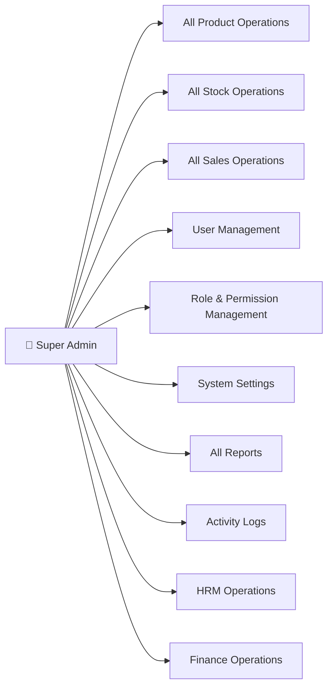

#### Panel 2: Admin Dashboard
**Access:** Administrative operations (cannot delete users)
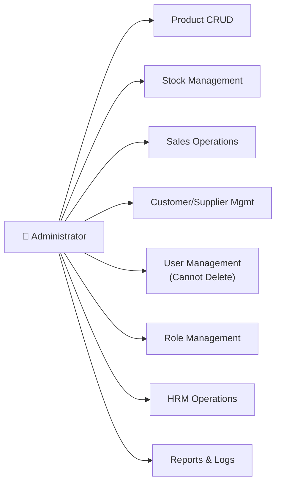

#### Panel 3: Store Manager Dashboard
**Access:** Store operations and daily management
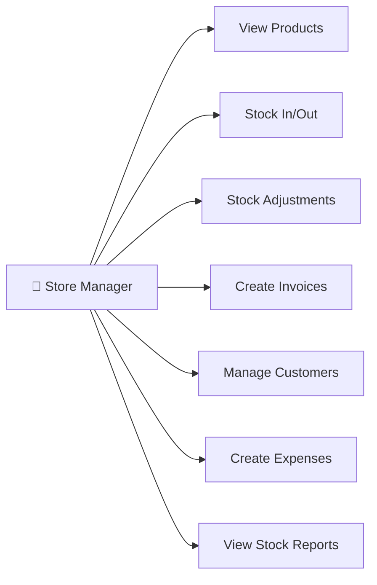

#### Panel 4: Sales Executive Dashboard
**Access:** Sales and billing operations
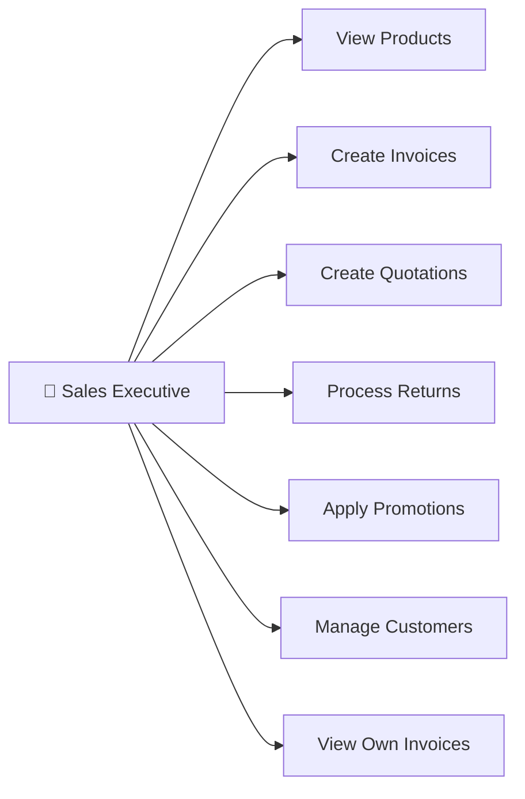

#### Panel 5: Accountant Dashboard
**Access:** Finance, GST, and accounting
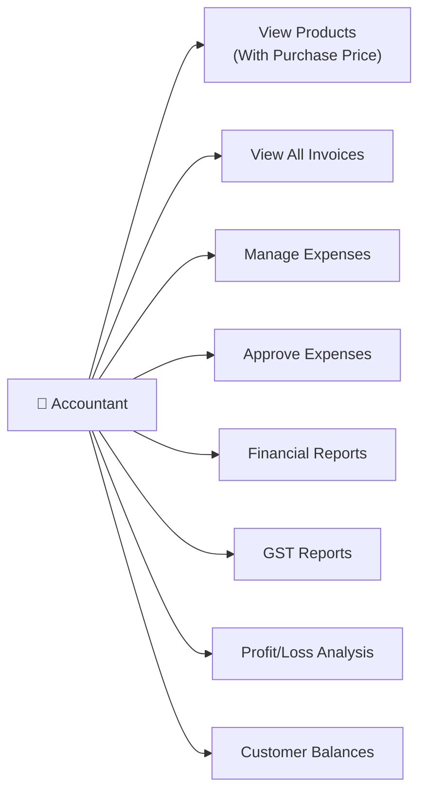

---

## 7.2. Class Diagram

### Core System Architecture

```mermaid
classDiagram
    %% Core Authentication & Authorization Classes
    class Session {
        -string sessionId
        -int userId
        -string userRole
        -datetime loginTime
        +start() void
        +isLoggedIn() bool
        +getUserId() int
        +getUserRole() string
        +destroy() void
        +regenerate() void
    }
    
    class AuthHelper {
        -Database db
        +login(email, password) bool
        +logout() void
        +register(userData) bool
        +validateCredentials(email, password) bool
        +hashPassword(password) string
        +verifyPassword(password, hash) bool
    }
    
    class PermissionMiddleware {
        +hasPermission(permissionName) bool
        +requirePermission(permissionName) void
        +hasAnyPermission(permissions[]) bool
        +hasAllPermissions(permissions[]) bool
        +getUserPermissions() array
        +getUserPermissionsByModule() array
    }
    
    class RoleManager {
        -Database db
        +getRoles() array
        +getRoleById(roleId) Role
        +createRole(roleData) bool
        +updateRole(roleId, roleData) bool
        +deleteRole(roleId) bool
        +assignPermissions(roleId, permissions[]) bool
        +getRolePermissions(roleId) array
    }
    
    class Database {
        -PDO connection
        -static instance
        +getInstance() Database
        +query(sql, params) array
        +queryOne(sql, params) array
        +execute(sql, params) bool
        +lastInsertId() int
        +beginTransaction() void
        +commit() void
        +rollback() void
    }
    
    class Validator {
        +validateEmail(email) bool
        +validatePhone(phone) bool
        +validateRequired(value) bool
        +validateNumeric(value) bool
        +validateDate(date) bool
        +sanitizeInput(input) string
    }
    
    %% Domain Models
    class User {
        -int id
        -string username
        -string email
        -string password
        -string fullName
        -string role
        -string phone
        -string address
        -string status
        -datetime createdAt
        -datetime lastLogin
        +save() bool
        +delete() bool
        +activate() bool
        +deactivate() bool
        +updatePassword(newPassword) bool
    }
    
    class Role {
        -int id
        -string name
        -string displayName
        -string description
        -array permissions
        -datetime createdAt
        +save() bool
        +delete() bool
        +addPermission(permission) bool
        +removePermission(permission) bool
        +hasPermission(permissionName) bool
    }
    
    class Permission {
        -int id
        -string name
        -string module
        -string action
        -string description
        +save() bool
        +delete() bool
    }
    
    class Product {
        -int id
        -string name
        -string sku
        -string barcode
        -string description
        -int categoryId
        -int brandId
        -string unit
        -decimal purchasePrice
        -decimal sellingPrice
        -decimal taxRate
        -int stockQuantity
        -int minStockLevel
        -int reorderLevel
        -string image
        -string status
        +save() bool
        +delete() bool
        +updateStock(quantity) bool
        +isLowStock() bool
    }
    
    class Category {
        -int id
        -string name
        -string description
        -int parentId
        -string status
        +save() bool
        +delete() bool
        +getChildren() array
        +hasChildren() bool
    }
    
    class Brand {
        -int id
        -string name
        -string description
        -string logo
        -string status
        +save() bool
        +delete() bool
    }
    
    class Invoice {
        -int id
        -string invoiceNumber
        -int customerId
        -date invoiceDate
        -date dueDate
        -decimal subtotal
        -decimal taxAmount
        -decimal discountAmount
        -decimal totalAmount
        -decimal paidAmount
        -string paymentStatus
        -string status
        -array items
        +save() bool
        +delete() bool
        +addItem(item) bool
        +removeItem(itemId) bool
        +calculateTotals() void
        +generatePDF() string
    }
    
    class InvoiceItem {
        -int id
        -int invoiceId
        -int productId
        -string productName
        -int quantity
        -decimal unitPrice
        -decimal taxRate
        -decimal lineTotal
        +save() bool
        +calculateTotal() decimal
    }
    
    class Customer {
        -int id
        -string name
        -string email
        -string phone
        -string company
        -string address
        -string gstNumber
        -decimal creditLimit
        -decimal outstandingBalance
        -string status
        +save() bool
        +delete() bool
        +updateBalance(amount) bool
        +getTransactionHistory() array
    }
    
    class Supplier {
        -int id
        -string name
        -string email
        -string phone
        -string company
        -string address
        -string gstNumber
        -string bankDetails
        -decimal outstandingBalance
        -string status
        +save() bool
        +delete() bool
    }
    
    class StockIn {
        -int id
        -string referenceNo
        -int productId
        -int warehouseId
        -int supplierId
        -int quantity
        -decimal unitCost
        -decimal totalCost
        -date receivedDate
        -string status
        +save() bool
        +updateProductStock() bool
    }
    
    class StockOut {
        -int id
        -string referenceNo
        -int productId
        -int warehouseId
        -int quantity
        -string reason
        -date issuedDate
        -string status
        +save() bool
        +updateProductStock() bool
    }
    
    class StockTransfer {
        -int id
        -string referenceNo
        -int productId
        -int fromWarehouseId
        -int toWarehouseId
        -int quantity
        -date transferDate
        -string status
        +save() bool
        +complete() bool
        +updateWarehouses() bool
    }
    
    class Warehouse {
        -int id
        -string name
        -string code
        -string address
        -int managerId
        -int capacity
        -string status
        +save() bool
        +delete() bool
        +getStockLevel() int
    }
    
    class Expense {
        -int id
        -string expenseNumber
        -string category
        -decimal amount
        -date expenseDate
        -string paymentMethod
        -string vendor
        -string description
        -string status
        +save() bool
        +approve() bool
        +reject() bool
    }
    
    class Employee {
        -int id
        -string employeeCode
        -int userId
        -string firstName
        -string lastName
        -string email
        -int departmentId
        -string designation
        -date dateOfJoining
        -decimal salary
        -string status
        +save() bool
        +delete() bool
        +linkToUser(userId) bool
    }
    
    class Department {
        -int id
        -string name
        -string code
        -string description
        -int managerId
        -string status
        +save() bool
        +delete() bool
        +getEmployees() array
    }
    
    class Attendance {
        -int id
        -int employeeId
        -date date
        -time checkIn
        -time checkOut
        -decimal totalHours
        -string status
        +save() bool
        +calculateHours() decimal
    }
    
    %% Relationships
    Session --> User : manages
    AuthHelper --> User : authenticates
    AuthHelper --> Database : uses
    PermissionMiddleware --> Session : checks
    PermissionMiddleware --> Role : validates
    PermissionMiddleware --> Permission : validates
    RoleManager --> Role : manages
    RoleManager --> Permission : assigns
    
    User --> Role : has
    Role --> Permission : contains many
    
    Product --> Category : belongs to
    Product --> Brand : belongs to
    
    Invoice --> Customer : belongs to
    Invoice --> InvoiceItem : contains many
    InvoiceItem --> Product : references
    
    StockIn --> Product : updates
    StockIn --> Warehouse : affects
    StockIn --> Supplier : from
    
    StockOut --> Product : updates
    StockOut --> Warehouse : affects
    
    StockTransfer --> Product : moves
    StockTransfer --> Warehouse : from/to
    
    Expense --> User : created by
    
    Employee --> User : linked to
    Employee --> Department : belongs to
    
    Attendance --> Employee : tracks
```

### Database Relationship Diagram

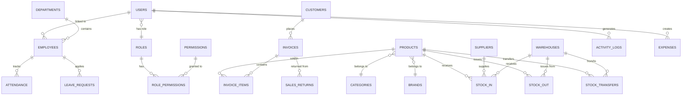

---

## 7.3. Activity Diagrams

### Activity Diagram 1: User Login & Dashboard Routing

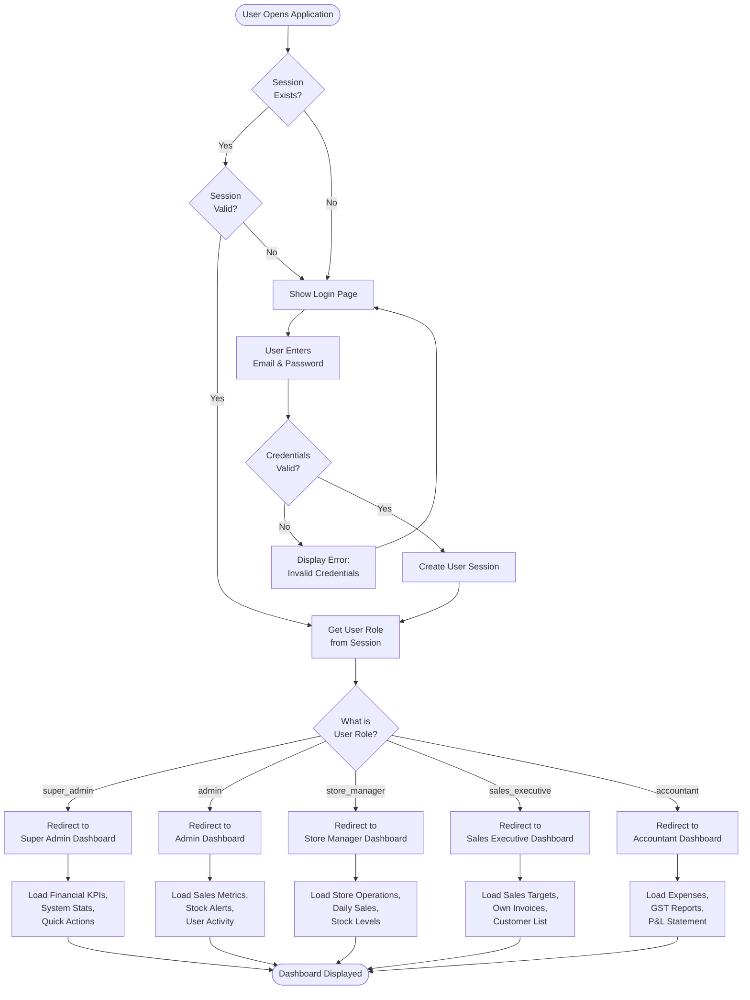

### Activity Diagram 2: Create Invoice Process

```mermaid
flowchart TD
    Start([Sales Executive<br/>Starts Invoice]) --> CheckPerm{Has<br/>create_invoice<br/>Permission?}
    
    CheckPerm -->|No| AccessDenied[Show Access<br/>Denied Error]
    AccessDenied --> End1([End])
    
    CheckPerm -->|Yes| OpenForm[Open Invoice Form]
    OpenForm --> SelectCustomer[Select Customer]
    SelectCustomer --> AddItem[Add Product Item]
    
    AddItem --> SelectProduct[Select Product<br/>from Dropdown]
    SelectProduct --> CheckStock{Stock<br/>Available?}
    
    CheckStock -->|No| StockWarning[Show Low/No<br/>Stock Warning]
    StockWarning --> AddItem
    
    CheckStock -->|Yes| EnterQty[Enter Quantity]
    EnterQty --> ValidateQty{Quantity ≤<br/>Available Stock?}
    
    ValidateQty -->|No| QtyError[Show Quantity<br/>Exceeds Stock]
    QtyError --> EnterQty
    
    ValidateQty -->|Yes| CalculateItem[Calculate Item Total<br/>Price × Qty × (1 + Tax%)]
    CalculateItem --> ItemAdded{More Items<br/>to Add?}
    
    ItemAdded -->|Yes| AddItem
    ItemAdded -->|No| ApplyDiscount{Apply<br/>Discount?}
    
    ApplyDiscount -->|Yes| CheckDiscPerm{Has<br/>give_discount<br/>Permission?}
    CheckDiscPerm -->|No| NoDiscMsg[Cannot Apply<br/>Discount]
    NoDiscMsg --> CalculateTotals
    CheckDiscPerm -->|Yes| EnterDiscount[Enter Discount %<br/>or Amount]
    EnterDiscount --> CalculateTotals[Calculate Invoice<br/>Totals]
    
    ApplyDiscount -->|No| CalculateTotals
    
    CalculateTotals --> ReviewInvoice[Review Invoice<br/>Summary]
    ReviewInvoice --> ConfirmSave{Confirm<br/>Save?}
    
    ConfirmSave -->|No| EditInvoice{Edit<br/>Invoice?}
    EditInvoice -->|Yes| OpenForm
    EditInvoice -->|No| CancelEnd([Invoice Cancelled])
    
    ConfirmSave -->|Yes| BeginTransaction[Start Database<br/>Transaction]
    BeginTransaction --> SaveInvoice[Save Invoice<br/>Header to DB]
    SaveInvoice --> SaveItems[Save Invoice<br/>Items to DB]
    SaveItems --> UpdateStock[Deduct Stock<br/>Quantities]
    UpdateStock --> UpdateCustomer[Update Customer<br/>Outstanding Balance]
    UpdateCustomer --> LogActivity[Log Activity:<br/>Invoice Created]
    LogActivity --> CommitTrans[Commit Transaction]
    CommitTrans --> GenerateNumber[Generate Invoice<br/>Number]
    GenerateNumber --> ShowSuccess[Show Success<br/>Message]
    ShowSuccess --> OfferPrint{Print/PDF<br/>Invoice?}
    
    OfferPrint -->|Yes| GeneratePDF[Generate PDF<br/>Invoice]
    GeneratePDF --> OpenPDF[Open/Download<br/>PDF]
    OpenPDF --> End2([End])
    
    OfferPrint -->|No| End2
```

### Activity Diagram 3: Stock In Process

```mermaid
flowchart TD
    Start([Store Manager<br/>Initiates Stock In]) --> CheckPerm{Has<br/>stock_in<br/>Permission?}
    
    CheckPerm -->|No| AccessDenied[Access Denied]
    AccessDenied --> End1([End])
    
    CheckPerm -->|Yes| OpenStockForm[Open Stock In Form]
    OpenStockForm --> GenRefNo[Auto-generate<br/>Reference Number]
    GenRefNo --> SelectProduct[Select Product]
    SelectProduct --> SelectWarehouse[Select Warehouse]
    SelectWarehouse --> SelectSupplier[Select Supplier<br/>(Optional)]
    SelectSupplier --> EnterQty[Enter Quantity]
    EnterQty --> ValidateQty{Quantity > 0?}
    
    ValidateQty -->|No| QtyError[Show Error:<br/>Invalid Quantity]
    QtyError --> EnterQty
    
    ValidateQty -->|Yes| EnterCost[Enter Unit Cost]
    EnterCost --> CalculateTotal[Calculate Total Cost<br/>Qty × Unit Cost]
    CalculateTotal --> EnterNotes[Enter Notes<br/>(Optional)]
    EnterNotes --> ReviewEntry[Review Stock In<br/>Entry]
    ReviewEntry --> ConfirmSave{Confirm<br/>Save?}
    
    ConfirmSave -->|No| EditEntry{Edit<br/>Entry?}
    EditEntry -->|Yes| OpenStockForm
    EditEntry -->|No| CancelEnd([Stock In Cancelled])
    
    ConfirmSave -->|Yes| BeginTrans[Start Database<br/>Transaction]
    BeginTrans --> SaveStockIn[Save to<br/>stock_in Table]
    SaveStockIn --> UpdateProduct[Update Product<br/>Stock Quantity:<br/>stock += qty]
    UpdateProduct --> CheckReorder{Stock ≥<br/>Reorder Level?}
    
    CheckReorder -->|Yes| ClearAlert[Clear Low<br/>Stock Alert]
    CheckReorder -->|No| KeepAlert[Keep Alert Active]
    
    ClearAlert & KeepAlert --> UpdateSupplier{Supplier<br/>Selected?}
    UpdateSupplier -->|Yes| UpdateSupplierBal[Update Supplier<br/>Outstanding]
    UpdateSupplier -->|No| LogActivity
    UpdateSupplierBal --> LogActivity[Log Activity:<br/>Stock In Created]
    
    LogActivity --> CommitTrans[Commit Transaction]
    CommitTrans --> ShowSuccess[Show Success:<br/>Stock Updated]
    ShowSuccess --> End2([End])
```

### Activity Diagram 4: Expense Approval Workflow

```mermaid
flowchart TD
    Start([Employee Creates<br/>Expense]) --> CheckPerm{Has<br/>create_expenses<br/>Permission?}
    
    CheckPerm -->|No| AccessDenied[Access Denied]
    AccessDenied --> End1([End])
    
    CheckPerm -->|Yes| OpenExpenseForm[Open Expense Form]
    OpenExpenseForm --> GenExpNum[Auto-generate<br/>Expense Number]
    GenExpNum --> SelectCategory[Select Category<br/>e.g., Office, Travel]
    SelectCategory --> EnterAmount[Enter Amount]
    EnterAmount --> SelectPayment[Select Payment<br/>Method]
    SelectPayment --> EnterVendor[Enter Vendor Name]
    EnterVendor --> EnterDesc[Enter Description]
    EnterDesc --> UploadReceipt{Upload<br/>Receipt?}
    
    UploadReceipt -->|Yes| AttachFile[Attach Receipt<br/>File]
    UploadReceipt -->|No| ReviewExpense
    AttachFile --> ReviewExpense[Review Expense<br/>Details]
    
    ReviewExpense --> SubmitExpense{Submit<br/>for Approval?}
    
    SubmitExpense -->|No| SaveDraft[Save as Draft]
    SaveDraft --> End2([End])
    
    SubmitExpense -->|Yes| SaveExpense[Save Expense<br/>Status: Pending]
    SaveExpense --> NotifyApprover[Notify Accountant/<br/>Admin for Approval]
    NotifyApprover --> WaitApproval[Wait for<br/>Approval]
    
    WaitApproval --> ApproverReview{Approver<br/>Reviews}
    
    ApproverReview --> CheckApprovePerm{Has<br/>approve_expenses<br/>Permission?}
    
    CheckApprovePerm -->|No| NoApprovePerm[Cannot Approve]
    NoApprovePerm --> WaitApproval
    
    CheckApprovePerm -->|Yes| ApproverDecision{Decision?}
    
    ApproverDecision -->|Reject| UpdateReject[Update Status:<br/>Rejected]
    UpdateReject --> NotifyRejection[Notify Employee:<br/>Expense Rejected]
    NotifyRejection --> End3([End])
    
    ApproverDecision -->|Approve| UpdateApprove[Update Status:<br/>Approved]
    UpdateApprove --> RecordApprover[Record Approved<br/>By & Date]
    RecordApprover --> ProcessPayment{Process<br/>Payment?}
    
    ProcessPayment -->|Yes| UpdatePaid[Update Status:<br/>Paid]
    UpdatePaid --> UpdateFinance[Update Financial<br/>Records]
    UpdateFinance --> NotifyApproval
    
    ProcessPayment -->|No| NotifyApproval[Notify Employee:<br/>Expense Approved]
    NotifyApproval --> End4([End])
```

### Activity Diagram 5: Role-Based Permission Check

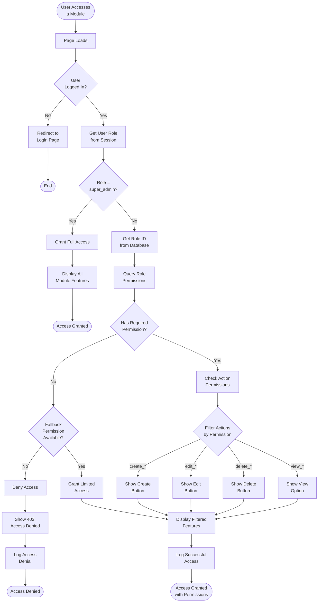

---

## Panel Summary

### Total Panels: 5

| Panel # | Panel Name | Dashboard File | User Role | Access Level |
|---------|------------|----------------|-----------|--------------|
| 1 | Super Admin Dashboard | `super-admin.php` | `super_admin` | Full System Access |
| 2 | Admin Dashboard | `admin.php` | `admin` | Administrative Access |
| 3 | Store Manager Dashboard | `store-manager.php` | `store_manager` | Store Operations |
| 4 | Sales Executive Dashboard | `sales-executive.php` | `sales_executive` | Sales & Billing |
| 5 | Accountant Dashboard | `accountant.php` | `accountant` | Finance & GST |

---

## Key Features Per Panel

### Panel 1: Super Admin (12 Modules)
- All Product, Stock, Sales Operations
- User & Role Management
- System Settings & Configuration
- All Reports & Analytics
- Activity Logs
- HRM Full Access
- Finance Full Access

### Panel 2: Admin (10 Modules)
- Product CRUD
- Stock Management
- Sales Operations
- Customer/Supplier Management
- User Management (Cannot Delete)
- Role Management
- HRM Operations
- Reports & Logs

### Panel 3: Store Manager (7 Modules)
- View Products
- Stock In/Out
- Stock Adjustments
- Create Invoices
- Manage Customers
- Create Expenses
- Stock Reports

### Panel 4: Sales Executive (5 Modules)
- View Products
- Create Invoices
- Create Quotations
- Process Returns
- Manage Customers
- View Own Sales

### Panel 5: Accountant (6 Modules)
- View Products (with costs)
- View All Invoices
- Manage Expenses
- Approve Expenses
- Financial Reports
- GST Reports
- Profit/Loss Analysis

---

**Document End**
