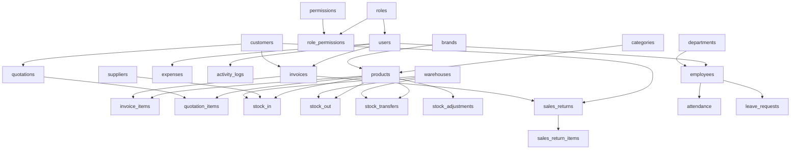

# StockSathi - Data Dictionary

**Project:** StockSathi - Inventory Management System  
**Database:** stocksathi  
**Version:** 2.0  
**Created:** 2026-01-26  
**Total Tables:** 30  
**Total Panels:** 5 (Super Admin, Admin, Store Manager, Sales Executive, Accountant)

---

## Table of Contents

1. [Database Overview](#database-overview)
2. [Module 1: Authentication & Authorization](#module-1-authentication--authorization)
3. [Module 2: Product Management](#module-2-product-management)
4. [Module 3: Stock Management](#module-3-stock-management)
5. [Module 4: Customer & Supplier Management](#module-4-customer--supplier-management)
6. [Module 5: Sales Management](#module-5-sales-management)
7. [Module 6: Finance Management](#module-6-finance-management)
8. [Module 7: Human Resource Management](#module-7-human-resource-management)
9. [Module 8: System Management](#module-8-system-management)
10. [Relationships Summary](#relationships-summary)
11. [Indexes & Performance](#indexes--performance)

---

## Database Overview

### Database Statistics

| Metric | Count |
|--------|-------|
| Total Tables | 30 |
| Total Columns | ~350 |
| Foreign Key Relationships | 25+ |
| Indexes | 50+ |
| User Roles | 5 |
| Modules | 8 |

### Database Configuration

```sql
Database Name: stocksathi
Character Set: utf8mb4
Collation: utf8mb4_unicode_ci
Engine: InnoDB (All tables)
Time Zone: +00:00 (UTC)
```

---

## Module 1: Authentication & Authorization

### Table 1.1: `users`
**Purpose:** Store user accounts with authentication and profile information

| Column Name | Data Type | Length | Constraints | Default | Description |
|-------------|-----------|--------|-------------|---------|-------------|
| `id` | INT | 11 | PRIMARY KEY, AUTO_INCREMENT | - | Unique user identifier |
| `username` | VARCHAR | 50 | NOT NULL, UNIQUE | - | Unique username for login |
| `email` | VARCHAR | 100 | NOT NULL, UNIQUE | - | User email address (also used for login) |
| `password` | VARCHAR | 255 | NOT NULL | - | Bcrypt hashed password |
| `full_name` | VARCHAR | 100 | NULL | NULL | Display name of user |
| `role` | VARCHAR | 20 | NULL | 'user' | User role (super_admin, admin, store_manager, sales_executive, accountant) |
| `phone` | VARCHAR | 20 | NULL | NULL | Contact phone number |
| `address` | TEXT | - | NULL | NULL | Physical address |
| `status` | ENUM | - | NULL | 'active' | Account status: active, inactive, suspended |
| `created_at` | TIMESTAMP | - | NOT NULL | CURRENT_TIMESTAMP | Account creation timestamp |
| `updated_at` | TIMESTAMP | - | NULL | NULL ON UPDATE | Last modification timestamp |
| `last_login` | TIMESTAMP | - | NULL | NULL | Last successful login timestamp |

**Indexes:**
- PRIMARY KEY: `id`
- UNIQUE: `username`, `email`
- INDEX: `role`, `status`

**Business Rules:**
- Password must be hashed using bcrypt (strength 10+)
- Email must be valid format
- Only one active user per email
- Super admin role has all permissions
- Status 'suspended' prevents login

---

### Table 1.2: `roles`
**Purpose:** Define user roles and their associated permissions

| Column Name | Data Type | Length | Constraints | Default | Description |
|-------------|-----------|--------|-------------|---------|-------------|
| `id` | INT | 11 | PRIMARY KEY, AUTO_INCREMENT | - | Unique role identifier |
| `name` | VARCHAR | 50 | NOT NULL, UNIQUE | - | System role name (snake_case) |
| `display_name` | VARCHAR | 100 | NOT NULL | - | Human-readable role name |
| `description` | TEXT | - | NULL | NULL | Role description and purpose |
| `permissions` | TEXT | - | NULL | NULL | Legacy JSON permissions (deprecated, use role_permissions) |
| `created_at` | TIMESTAMP | - | NOT NULL | CURRENT_TIMESTAMP | Role creation timestamp |

**Indexes:**
- PRIMARY KEY: `id`
- UNIQUE: `name`

**Sample Data:**
```sql
super_admin    - Super Administrator - Full system access
admin          - Administrator - Administrative access
store_manager  - Store Manager - Store operations
sales_executive - Sales Executive - Sales and billing
accountant     - Accountant - Finance and GST
```

**Business Rules:**
- Role name must be unique and lowercase with underscores
- Cannot delete role if assigned to users
- Super admin role is system-protected

---

### Table 1.3: `permissions`
**Purpose:** Define granular permissions for role-based access control

| Column Name | Data Type | Length | Constraints | Default | Description |
|-------------|-----------|--------|-------------|---------|-------------|
| `id` | INT | 11 | PRIMARY KEY, AUTO_INCREMENT | - | Unique permission identifier |
| `name` | VARCHAR | 100 | NOT NULL, UNIQUE | - | Permission identifier (e.g., create_products) |
| `module` | VARCHAR | 50 | NOT NULL | - | Module name (products, sales, etc.) |
| `action` | VARCHAR | 50 | NOT NULL | - | Action type (view, create, edit, delete, approve) |
| `description` | TEXT | - | NULL | NULL | Human-readable permission description |
| `created_at` | TIMESTAMP | - | NOT NULL | CURRENT_TIMESTAMP | Permission creation timestamp |

**Indexes:**
- PRIMARY KEY: `id`
- UNIQUE: `name`
- INDEX: `module`, `action`

**Permission Naming Convention:**
`{action}_{module}` - Example: `create_products`, `view_invoices`, `approve_expenses`

**Common Modules:**
- dashboard, products, inventory, sales, customers, suppliers, expenses, reports, users, settings, hrm

**Common Actions:**
- view, create, edit, delete, approve, export

---

### Table 1.4: `role_permissions`
**Purpose:** Junction table linking roles to permissions (many-to-many)

| Column Name | Data Type | Length | Constraints | Default | Description |
|-------------|-----------|--------|-------------|---------|-------------|
| `id` | INT | 11 | PRIMARY KEY, AUTO_INCREMENT | - | Unique record identifier |
| `role_id` | INT | 11 | NOT NULL, FOREIGN KEY | - | Reference to roles.id |
| `permission_id` | INT | 11 | NOT NULL, FOREIGN KEY | - | Reference to permissions.id |
| `created_at` | TIMESTAMP | - | NOT NULL | CURRENT_TIMESTAMP | Assignment timestamp |

**Indexes:**
- PRIMARY KEY: `id`
- UNIQUE: `role_id + permission_id` (composite)
- FOREIGN KEY: `role_id` REFERENCES `roles(id)` ON DELETE CASCADE
- FOREIGN KEY: `permission_id` REFERENCES `permissions(id)` ON DELETE CASCADE

**Business Rules:**
- Each role-permission pair must be unique
- Deleting role removes all associated permissions
- Super admin bypasses permission checks

---

## Module 2: Product Management

### Table 2.1: `categories`
**Purpose:** Product categorization with hierarchical support

| Column Name | Data Type | Length | Constraints | Default | Description |
|-------------|-----------|--------|-------------|---------|-------------|
| `id` | INT | 11 | PRIMARY KEY, AUTO_INCREMENT | - | Unique category identifier |
| `name` | VARCHAR | 100 | NOT NULL, UNIQUE | - | Category name |
| `description` | TEXT | - | NULL | NULL | Category description |
| `parent_id` | INT | 11 | NULL, FOREIGN KEY | NULL | Parent category for hierarchy |
| `status` | ENUM | - | NULL | 'active' | active, inactive |
| `created_at` | TIMESTAMP | - | NOT NULL | CURRENT_TIMESTAMP | Creation timestamp |
| `updated_at` | TIMESTAMP | - | NULL | NULL ON UPDATE | Last update timestamp |

**Indexes:**
- PRIMARY KEY: `id`
- UNIQUE: `name`
- INDEX: `parent_id`

**Business Rules:**
- Categories can have unlimited nesting levels
- Parent category must exist if parent_id is set
- Cannot delete category with child categories
- Cannot delete category with associated products

---

### Table 2.2: `brands`
**Purpose:** Product brand/manufacturer information

| Column Name | Data Type | Length | Constraints | Default | Description |
|-------------|-----------|--------|-------------|---------|-------------|
| `id` | INT | 11 | PRIMARY KEY, AUTO_INCREMENT | - | Unique brand identifier |
| `name` | VARCHAR | 100 | NOT NULL, UNIQUE | - | Brand name |
| `description` | TEXT | - | NULL | NULL | Brand description |
| `logo` | VARCHAR | 255 | NULL | NULL | Brand logo file path |
| `status` | ENUM | - | NULL | 'active' | active, inactive |
| `created_at` | TIMESTAMP | - | NOT NULL | CURRENT_TIMESTAMP | Creation timestamp |
| `updated_at` | TIMESTAMP | - | NULL | NULL ON UPDATE | Last update timestamp |

**Indexes:**
- PRIMARY KEY: `id`
- UNIQUE: `name`

**Business Rules:**
- Brand name must be unique
- Cannot delete brand with associated products
- Logo should be stored in /assets/brands/

---

### Table 2.3: `products`
**Purpose:** Core product master data with pricing and stock information

| Column Name | Data Type | Length | Constraints | Default | Description |
|-------------|-----------|--------|-------------|---------|-------------|
| `id` | INT | 11 | PRIMARY KEY, AUTO_INCREMENT | - | Unique product identifier |
| `name` | VARCHAR | 200 | NOT NULL | - | Product name |
| `sku` | VARCHAR | 100 | NULL, UNIQUE | NULL | Stock Keeping Unit code |
| `barcode` | VARCHAR | 100 | NULL, UNIQUE | NULL | Product barcode |
| `description` | TEXT | - | NULL | NULL | Detailed product description |
| `category_id` | INT | 11 | NULL, FOREIGN KEY | NULL | Reference to categories.id |
| `brand_id` | INT | 11 | NULL, FOREIGN KEY | NULL | Reference to brands.id |
| `unit` | VARCHAR | 20 | NULL | 'pcs' | Unit of measurement (pcs, kg, liter, box, etc.) |
| `purchase_price` | DECIMAL | 10,2 | NULL | 0.00 | Cost price per unit |
| `selling_price` | DECIMAL | 10,2 | NULL | 0.00 | Selling price per unit |
| `tax_rate` | DECIMAL | 5,2 | NULL | 0.00 | Tax percentage (e.g., 18.00 for 18% GST) |
| `stock_quantity` | INT | 11 | NULL | 0 | Current available stock |
| `min_stock_level` | INT | 11 | NULL | 10 | Minimum stock threshold for alerts |
| `max_stock_level` | INT | 11 | NULL | 1000 | Maximum stock capacity |
| `reorder_level` | INT | 11 | NULL | 20 | Reorder point for procurement |
| `image` | VARCHAR | 255 | NULL | NULL | Product image file path |
| `status` | ENUM | - | NULL | 'active' | active, inactive, discontinued |
| `created_at` | TIMESTAMP | - | NOT NULL | CURRENT_TIMESTAMP | Creation timestamp |
| `updated_at` | TIMESTAMP | - | NULL | NULL ON UPDATE | Last update timestamp |

**Indexes:**
- PRIMARY KEY: `id`
- UNIQUE: `sku`, `barcode`
- INDEX: `category_id`, `brand_id`, `status`
- FOREIGN KEY: `category_id` REFERENCES `categories(id)` ON DELETE SET NULL
- FOREIGN KEY: `brand_id` REFERENCES `brands(id)` ON DELETE SET NULL

**Business Rules:**
- SKU and Barcode must be unique if provided
- Selling price should be >= purchase price (profit check)
- Stock quantity cannot be negative
- Low stock alert when stock_quantity < min_stock_level
- Auto-reorder suggestion when stock_quantity <= reorder_level
- Image stored in /assets/products/

---

## Module 3: Stock Management

### Table 3.1: `warehouses`
**Purpose:** Warehouse/storage location master data

| Column Name | Data Type | Length | Constraints | Default | Description |
|-------------|-----------|--------|-------------|---------|-------------|
| `id` | INT | 11 | PRIMARY KEY, AUTO_INCREMENT | - | Unique warehouse identifier |
| `name` | VARCHAR | 100 | NOT NULL | - | Warehouse name |
| `code` | VARCHAR | 50 | NULL, UNIQUE | NULL | Warehouse code |
| `address` | TEXT | - | NULL | NULL | Physical address |
| `city` | VARCHAR | 100 | NULL | NULL | City name |
| `state` | VARCHAR | 100 | NULL | NULL | State/Province |
| `pincode` | VARCHAR | 10 | NULL | NULL | Postal code |
| `phone` | VARCHAR | 20 | NULL | NULL | Contact phone |
| `email` | VARCHAR | 100 | NULL | NULL | Contact email |
| `manager_id` | INT | 11 | NULL, FOREIGN KEY | NULL | Warehouse manager (users.id) |
| `capacity` | INT | 11 | NULL | NULL | Storage capacity (units) |
| `status` | ENUM | - | NULL | 'active' | active, inactive |
| `created_at` | TIMESTAMP | - | NOT NULL | CURRENT_TIMESTAMP | Creation timestamp |
| `updated_at` | TIMESTAMP | - | NULL | NULL ON UPDATE | Last update timestamp |

**Indexes:**
- PRIMARY KEY: `id`
- UNIQUE: `code`
- INDEX: `manager_id`

---

### Table 3.2: `stores`
**Purpose:** Retail store locations

| Column Name | Data Type | Length | Constraints | Default | Description |
|-------------|-----------|--------|-------------|---------|-------------|
| `id` | INT | 11 | PRIMARY KEY, AUTO_INCREMENT | - | Unique store identifier |
| `name` | VARCHAR | 100 | NOT NULL | - | Store name |
| `code` | VARCHAR | 50 | NULL, UNIQUE | NULL | Store code |
| `address` | TEXT | - | NULL | NULL | Physical address |
| `city` | VARCHAR | 100 | NULL | NULL | City name |
| `state` | VARCHAR | 100 | NULL | NULL | State/Province |
| `pincode` | VARCHAR | 10 | NULL | NULL | Postal code |
| `phone` | VARCHAR | 20 | NULL | NULL | Contact phone |
| `email` | VARCHAR | 100 | NULL | NULL | Contact email |
| `manager_id` | INT | 11 | NULL | NULL | Store manager (users.id) |
| `status` | ENUM | - | NULL | 'active' | active, inactive |
| `created_at` | TIMESTAMP | - | NOT NULL | CURRENT_TIMESTAMP | Creation timestamp |
| `updated_at` | TIMESTAMP | - | NULL | NULL ON UPDATE | Last update timestamp |

**Indexes:**
- PRIMARY KEY: `id`
- UNIQUE: `code`
- INDEX: `manager_id`

---

### Table 3.3: `stock_in`
**Purpose:** Track incoming stock/purchases

| Column Name | Data Type | Length | Constraints | Default | Description |
|-------------|-----------|--------|-------------|---------|-------------|
| `id` | INT | 11 | PRIMARY KEY, AUTO_INCREMENT | - | Unique record identifier |
| `reference_no` | VARCHAR | 50 | NOT NULL | - | Purchase order/GRN reference |
| `product_id` | INT | 11 | NOT NULL, FOREIGN KEY | - | Reference to products.id |
| `warehouse_id` | INT | 11 | NULL, FOREIGN KEY | NULL | Destination warehouse |
| `supplier_id` | INT | 11 | NULL, FOREIGN KEY | NULL | Reference to suppliers.id |
| `quantity` | INT | 11 | NOT NULL | - | Quantity received |
| `unit_cost` | DECIMAL | 10,2 | NULL | 0.00 | Cost per unit |
| `total_cost` | DECIMAL | 10,2 | NULL | 0.00 | Total cost (qty × unit_cost) |
| `notes` | TEXT | - | NULL | NULL | Additional notes |
| `received_by` | INT | 11 | NULL | NULL | User who received (users.id) |
| `received_date` | DATE | - | NULL | NULL | Date of receipt |
| `status` | ENUM | - | NULL | 'pending' | pending, completed, cancelled |
| `created_at` | TIMESTAMP | - | NOT NULL | CURRENT_TIMESTAMP | Creation timestamp |
| `updated_at` | TIMESTAMP | - | NULL | NULL ON UPDATE | Last update timestamp |

**Indexes:**
- PRIMARY KEY: `id`
- INDEX: `product_id`, `warehouse_id`, `supplier_id`, `received_by`
- FOREIGN KEY: `product_id` REFERENCES `products(id)` ON DELETE CASCADE

**Business Rules:**
- Quantity must be > 0
- Total cost auto-calculated: quantity × unit_cost
- On status 'completed', product.stock_quantity increases
- Cannot delete if status is 'completed'

---

### Table 3.4: `stock_out`
**Purpose:** Track outgoing stock/issues

| Column Name | Data Type | Length | Constraints | Default | Description |
|-------------|-----------|--------|-------------|---------|-------------|
| `id` | INT | 11 | PRIMARY KEY, AUTO_INCREMENT | - | Unique record identifier |
| `reference_no` | VARCHAR | 50 | NOT NULL | - | Issue reference number |
| `product_id` | INT | 11 | NOT NULL, FOREIGN KEY | - | Reference to products.id |
| `warehouse_id` | INT | 11 | NULL, FOREIGN KEY | NULL | Source warehouse |
| `quantity` | INT | 11 | NOT NULL | - | Quantity issued |
| `unit_cost` | DECIMAL | 10,2 | NULL | 0.00 | Cost per unit |
| `total_cost` | DECIMAL | 10,2 | NULL | 0.00 | Total cost |
| `reason` | VARCHAR | 200 | NULL | NULL | Reason for stock out (damage, sample, etc.) |
| `notes` | TEXT | - | NULL | NULL | Additional notes |
| `issued_by` | INT | 11 | NULL | NULL | User who issued (users.id) |
| `issued_date` | DATE | - | NULL | NULL | Date of issue |
| `status` | ENUM | - | NULL | 'pending' | pending, completed, cancelled |
| `created_at` | TIMESTAMP | - | NOT NULL | CURRENT_TIMESTAMP | Creation timestamp |
| `updated_at` | TIMESTAMP | - | NULL | NULL ON UPDATE | Last update timestamp |

**Indexes:**
- PRIMARY KEY: `id`
- INDEX: `product_id`, `warehouse_id`, `issued_by`
- FOREIGN KEY: `product_id` REFERENCES `products(id)` ON DELETE CASCADE

**Business Rules:**
- Quantity must be <= available stock
- On status 'completed', product.stock_quantity decreases
- Common reasons: Damage, Sample, Internal Use, Loss

---

### Table 3.5: `stock_adjustments`
**Purpose:** Manual stock corrections and adjustments

| Column Name | Data Type | Length | Constraints | Default | Description |
|-------------|-----------|--------|-------------|---------|-------------|
| `id` | INT | 11 | PRIMARY KEY, AUTO_INCREMENT | - | Unique adjustment identifier |
| `reference_no` | VARCHAR | 50 | NOT NULL | - | Adjustment reference number |
| `product_id` | INT | 11 | NOT NULL, FOREIGN KEY | - | Reference to products.id |
| `warehouse_id` | INT | 11 | NULL, FOREIGN KEY | NULL | Affected warehouse |
| `type` | ENUM | - | NOT NULL | - | addition, subtraction |
| `quantity` | INT | 11 | NOT NULL | - | Adjustment quantity |
| `reason` | VARCHAR | 200 | NULL | NULL | Reason for adjustment |
| `notes` | TEXT | - | NULL | NULL | Detailed notes |
| `adjusted_by` | INT | 11 | NULL | NULL | User who made adjustment |
| `adjustment_date` | DATE | - | NULL | NULL | Date of adjustment |
| `created_at` | TIMESTAMP | - | NOT NULL | CURRENT_TIMESTAMP | Creation timestamp |
| `updated_at` | TIMESTAMP | - | NULL | NULL ON UPDATE | Last update timestamp |

**Indexes:**
- PRIMARY KEY: `id`
- INDEX: `product_id`, `warehouse_id`, `adjusted_by`
- FOREIGN KEY: `product_id` REFERENCES `products(id)` ON DELETE CASCADE

**Business Rules:**
- Type 'addition': increases stock
- Type 'subtraction': decreases stock
- Requires proper authorization (adjust_stock permission)
- All adjustments are logged for audit

---

### Table 3.6: `stock_transfers`
**Purpose:** Inter-warehouse stock transfers

| Column Name | Data Type | Length | Constraints | Default | Description |
|-------------|-----------|--------|-------------|---------|-------------|
| `id` | INT | 11 | PRIMARY KEY, AUTO_INCREMENT | - | Unique transfer identifier |
| `reference_no` | VARCHAR | 50 | NOT NULL | - | Transfer reference number |
| `product_id` | INT | 11 | NOT NULL, FOREIGN KEY | - | Reference to products.id |
| `from_warehouse_id` | INT | 11 | NOT NULL, FOREIGN KEY | - | Source warehouse |
| `to_warehouse_id` | INT | 11 | NOT NULL, FOREIGN KEY | - | Destination warehouse |
| `quantity` | INT | 11 | NOT NULL | - | Transfer quantity |
| `notes` | TEXT | - | NULL | NULL | Transfer notes |
| `transferred_by` | INT | 11 | NULL | NULL | User initiating transfer |
| `transfer_date` | DATE | - | NULL | NULL | Transfer date |
| `status` | ENUM | - | NULL | 'pending' | pending, in-transit, completed, cancelled |
| `created_at` | TIMESTAMP | - | NOT NULL | CURRENT_TIMESTAMP | Creation timestamp |
| `updated_at` | TIMESTAMP | - | NULL | NULL ON UPDATE | Last update timestamp |

**Indexes:**
- PRIMARY KEY: `id`
- INDEX: `product_id`, `from_warehouse_id`, `to_warehouse_id`, `transferred_by`
- FOREIGN KEY: `product_id` REFERENCES `products(id)` ON DELETE CASCADE

**Business Rules:**
- from_warehouse_id ≠ to_warehouse_id
- Quantity must be available in source warehouse
- Status flow: pending → in-transit → completed
- On 'completed': deduct from source, add to destination

---

## Module 4: Customer & Supplier Management

### Table 4.1: `customers`
**Purpose:** Customer master data with credit management

| Column Name | Data Type | Length | Constraints | Default | Description |
|-------------|-----------|--------|-------------|---------|-------------|
| `id` | INT | 11 | PRIMARY KEY, AUTO_INCREMENT | - | Unique customer identifier |
| `name` | VARCHAR | 100 | NOT NULL | - | Customer name |
| `email` | VARCHAR | 100 | NULL, UNIQUE | NULL | Email address |
| `phone` | VARCHAR | 20 | NULL | NULL | Contact phone |
| `company` | VARCHAR | 100 | NULL | NULL | Company name |
| `address` | TEXT | - | NULL | NULL | Billing/Shipping address |
| `city` | VARCHAR | 100 | NULL | NULL | City name |
| `state` | VARCHAR | 100 | NULL | NULL | State/Province |
| `pincode` | VARCHAR | 10 | NULL | NULL | Postal code |
| `gst_number` | VARCHAR | 50 | NULL | NULL | GST registration number |
| `credit_limit` | DECIMAL | 10,2 | NULL | 0.00 | Maximum credit allowed |
| `outstanding_balance` | DECIMAL | 10,2 | NULL | 0.00 | Current outstanding amount |
| `status` | ENUM | - | NULL | 'active' | active, inactive, blocked |
| `created_at` | TIMESTAMP | - | NOT NULL | CURRENT_TIMESTAMP | Creation timestamp |
| `updated_at` | TIMESTAMP | - | NULL | NULL ON UPDATE | Last update timestamp |

**Indexes:**
- PRIMARY KEY: `id`
- UNIQUE: `email`
- INDEX: `phone`, `status`

**Business Rules:**
- Email must be unique if provided
- Cannot delete customer with outstanding balance > 0
- Status 'blocked' prevents new sales
- Outstanding balance updated with each invoice/payment
- Alert if outstanding_balance > credit_limit

---

### Table 4.2: `suppliers`
**Purpose:** Supplier/vendor master data

| Column Name | Data Type | Length | Constraints | Default | Description |
|-------------|-----------|--------|-------------|---------|-------------|
| `id` | INT | 11 | PRIMARY KEY, AUTO_INCREMENT | - | Unique supplier identifier |
| `name` | VARCHAR | 100 | NOT NULL | - | Supplier name |
| `email` | VARCHAR | 100 | NULL, UNIQUE | NULL | Email address |
| `phone` | VARCHAR | 20 | NULL | NULL | Contact phone |
| `company` | VARCHAR | 100 | NULL | NULL | Company name |
| `address` | TEXT | - | NULL | NULL | Address |
| `city` | VARCHAR | 100 | NULL | NULL | City name |
| `state` | VARCHAR | 100 | NULL | NULL | State/Province |
| `pincode` | VARCHAR | 10 | NULL | NULL | Postal code |
| `gst_number` | VARCHAR | 50 | NULL | NULL | GST registration number |
| `bank_name` | VARCHAR | 100 | NULL | NULL | Bank name for payments |
| `bank_account` | VARCHAR | 50 | NULL | NULL | Bank account number |
| `ifsc_code` | VARCHAR | 20 | NULL | NULL | IFSC/Bank routing code |
| `payment_terms` | VARCHAR | 100 | NULL | NULL | Payment terms (Net 30, Net 60, etc.) |
| `outstanding_balance` | DECIMAL | 10,2 | NULL | 0.00 | Current payable amount |
| `status` | ENUM | - | NULL | 'active' | active, inactive, blocked |
| `created_at` | TIMESTAMP | - | NOT NULL | CURRENT_TIMESTAMP | Creation timestamp |
| `updated_at` | TIMESTAMP | - | NULL | NULL ON UPDATE | Last update timestamp |

**Indexes:**
- PRIMARY KEY: `id`
- UNIQUE: `email`
- INDEX: `phone`, `status`

**Business Rules:**
- Email must be unique if provided
- Outstanding balance updated with purchases/payments
- Payment terms: Net 30, Net 45, Net 60, COD, Advance

---

## Module 5: Sales Management

### Table 5.1: `invoices`
**Purpose:** Sales invoice headers with totals and payment tracking

| Column Name | Data Type | Length | Constraints | Default | Description |
|-------------|-----------|--------|-------------|---------|-------------|
| `id` | INT | 11 | PRIMARY KEY, AUTO_INCREMENT | - | Unique invoice identifier |
| `invoice_number` | VARCHAR | 50 | NOT NULL, UNIQUE | - | Invoice number (e.g., INV-2024-001) |
| `customer_id` | INT | 11 | NULL, FOREIGN KEY | NULL | Reference to customers.id |
| `invoice_date` | DATE | - | NOT NULL | - | Invoice issue date |
| `due_date` | DATE | - | NULL | NULL | Payment due date |
| `subtotal` | DECIMAL | 10,2 | NULL | 0.00 | Sum of all line items before tax/discount |
| `tax_amount` | DECIMAL | 10,2 | NULL | 0.00 | Total tax amount |
| `discount_amount` | DECIMAL | 10,2 | NULL | 0.00 | Total discount amount |
| `shipping_amount` | DECIMAL | 10,2 | NULL | 0.00 | Shipping/delivery charges |
| `total_amount` | DECIMAL | 10,2 | NULL | 0.00 | Final amount (subtotal + tax - discount + shipping) |
| `paid_amount` | DECIMAL | 10,2 | NULL | 0.00 | Amount paid so far |
| `balance_amount` | DECIMAL | 10,2 | NULL | 0.00 | Remaining balance (total - paid) |
| `payment_status` | ENUM | - | NULL | 'unpaid' | unpaid, partial, paid, overdue |
| `payment_method` | VARCHAR | 50 | NULL | NULL | Cash, Card, UPI, Bank Transfer, Cheque |
| `notes` | TEXT | - | NULL | NULL | Internal notes |
| `terms_conditions` | TEXT | - | NULL | NULL | Invoice terms and conditions |
| `created_by` | INT | 11 | NULL | NULL | User who created invoice |
| `status` | ENUM | - | NULL | 'draft' | draft, sent, paid, cancelled |
| `created_at` | TIMESTAMP | - | NOT NULL | CURRENT_TIMESTAMP | Creation timestamp |
| `updated_at` | TIMESTAMP | - | NULL | NULL ON UPDATE | Last update timestamp |

**Indexes:**
- PRIMARY KEY: `id`
- UNIQUE: `invoice_number`
- INDEX: `customer_id`, `invoice_date`, `payment_status`
- FOREIGN KEY: `customer_id` REFERENCES `customers(id)` ON DELETE SET NULL

**Business Rules:**
- Invoice number format: {prefix}-{year}-{sequential}
- Total amount = subtotal + tax_amount - discount_amount + shipping_amount
- Balance amount = total_amount - paid_amount
- Payment status auto-updates based on paid_amount
- Stock deduction happens on invoice creation
- Only draft invoices can be edited/deleted

**Payment Status Logic:**
- unpaid: paid_amount = 0
- partial: 0 < paid_amount < total_amount
- paid: paid_amount = total_amount
- overdue: unpaid/partial and current_date > due_date

---

### Table 5.2: `invoice_items`
**Purpose:** Individual line items within invoices

| Column Name | Data Type | Length | Constraints | Default | Description |
|-------------|-----------|--------|-------------|---------|-------------|
| `id` | INT | 11 | PRIMARY KEY, AUTO_INCREMENT | - | Unique line item identifier |
| `invoice_id` | INT | 11 | NOT NULL, FOREIGN KEY | - | Reference to invoices.id |
| `product_id` | INT | 11 | NOT NULL, FOREIGN KEY | - | Reference to products.id |
| `product_name` | VARCHAR | 200 | NOT NULL | - | Product name (snapshot at time of sale) |
| `quantity` | INT | 11 | NOT NULL | - | Quantity sold |
| `unit_price` | DECIMAL | 10,2 | NOT NULL | - | Price per unit |
| `tax_rate` | DECIMAL | 5,2 | NULL | 0.00 | Tax percentage for this item |
| `tax_amount` | DECIMAL | 10,2 | NULL | 0.00 | Calculated tax amount |
| `discount_rate` | DECIMAL | 5,2 | NULL | 0.00 | Discount percentage |
| `discount_amount` | DECIMAL | 10,2 | NULL | 0.00 | Calculated discount amount |
| `line_total` | DECIMAL | 10,2 | NOT NULL | - | Total for this line |

**Indexes:**
- PRIMARY KEY: `id`
- INDEX: `invoice_id`, `product_id`
- FOREIGN KEY: `invoice_id` REFERENCES `invoices(id)` ON DELETE CASCADE
- FOREIGN KEY: `product_id` REFERENCES `products(id)` ON DELETE CASCADE

**Business Rules:**
- Line total = (quantity × unit_price) × (1 + tax_rate/100) × (1 - discount_rate/100)
- Product name stored to preserve historical data
- Deleting invoice deletes all items (CASCADE)

---

### Table 5.3: `quotations`
**Purpose:** Sales quotations/price estimates

| Column Name | Data Type | Length | Constraints | Default | Description |
|-------------|-----------|--------|-------------|---------|-------------|
| `id` | INT | 11 | PRIMARY KEY, AUTO_INCREMENT | - | Unique quotation identifier |
| `quotation_number` | VARCHAR | 50 | NOT NULL, UNIQUE | - | Quotation number (e.g., QUO-2024-001) |
| `customer_id` | INT | 11 | NULL, FOREIGN KEY | NULL | Reference to customers.id |
| `quotation_date` | DATE | - | NOT NULL | - | Quotation issue date |
| `valid_until` | DATE | - | NULL | NULL | Quotation validity date |
| `subtotal` | DECIMAL | 10,2 | NULL | 0.00 | Sum before tax |
| `tax_amount` | DECIMAL | 10,2 | NULL | 0.00 | Total tax |
| `discount_amount` | DECIMAL | 10,2 | NULL | 0.00 | Total discount |
| `total_amount` | DECIMAL | 10,2 | NULL | 0.00 | Final quoted amount |
| `notes` | TEXT | - | NULL | NULL | Notes for customer |
| `terms_conditions` | TEXT | - | NULL | NULL | Quotation T&C |
| `created_by` | INT | 11 | NULL | NULL | User who created quotation |
| `status` | ENUM | - | NULL | 'draft' | draft, sent, accepted, rejected, expired, converted |
| `created_at` | TIMESTAMP | - | NOT NULL | CURRENT_TIMESTAMP | Creation timestamp |
| `updated_at` | TIMESTAMP | - | NULL | NULL ON UPDATE | Last update timestamp |

**Indexes:**
- PRIMARY KEY: `id`
- UNIQUE: `quotation_number`
- INDEX: `customer_id`, `quotation_date`, `status`
- FOREIGN KEY: `customer_id` REFERENCES `customers(id)` ON DELETE SET NULL

**Business Rules:**
- Status 'expired' if current_date > valid_until
- Status 'converted' when converted to invoice
- Quotation number format: {prefix}-{year}-{sequential}

---

### Table 5.4: `quotation_items`
**Purpose:** Line items in quotations

| Column Name | Data Type | Length | Constraints | Default | Description |
|-------------|-----------|--------|-------------|---------|-------------|
| `id` | INT | 11 | PRIMARY KEY, AUTO_INCREMENT | - | Unique line item identifier |
| `quotation_id` | INT | 11 | NOT NULL, FOREIGN KEY | - | Reference to quotations.id |
| `product_id` | INT | 11 | NOT NULL, FOREIGN KEY | - | Reference to products.id |
| `product_name` | VARCHAR | 200 | NOT NULL | - | Product name |
| `quantity` | INT | 11 | NOT NULL | - | Quoted quantity |
| `unit_price` | DECIMAL | 10,2 | NOT NULL | - | Price per unit |
| `tax_rate` | DECIMAL | 5,2 | NULL | 0.00 | Tax percentage |
| `tax_amount` | DECIMAL | 10,2 | NULL | 0.00 | Tax amount |
| `discount_rate` | DECIMAL | 5,2 | NULL | 0.00 | Discount percentage |
| `discount_amount` | DECIMAL | 10,2 | NULL | 0.00 | Discount amount |
| `line_total` | DECIMAL | 10,2 | NOT NULL | - | Line total |

**Indexes:**
- PRIMARY KEY: `id`
- INDEX: `quotation_id`, `product_id`
- FOREIGN KEY: `quotation_id` REFERENCES `quotations(id)` ON DELETE CASCADE
- FOREIGN KEY: `product_id` REFERENCES `products(id)` ON DELETE CASCADE

---

### Table 5.5: `sales_returns`
**Purpose:** Sales return/refund tracking

| Column Name | Data Type | Length | Constraints | Default | Description |
|-------------|-----------|--------|-------------|---------|-------------|
| `id` | INT | 11 | PRIMARY KEY, AUTO_INCREMENT | - | Unique return identifier |
| `return_number` | VARCHAR | 50 | NOT NULL, UNIQUE | - | Return reference number |
| `invoice_id` | INT | 11 | NULL, FOREIGN KEY | NULL | Original invoice reference |
| `customer_id` | INT | 11 | NULL, FOREIGN KEY | NULL | Reference to customers.id |
| `return_date` | DATE | - | NOT NULL | - | Return date |
| `total_amount` | DECIMAL | 10,2 | NULL | 0.00 | Total return amount |
| `refund_amount` | DECIMAL | 10,2 | NULL | 0.00 | Amount refunded |
| `refund_method` | VARCHAR | 50 | NULL | NULL | Cash, Card, Bank Transfer |
| `reason` | VARCHAR | 200 | NULL | NULL | Return reason |
| `notes` | TEXT | - | NULL | NULL | Additional notes |
| `processed_by` | INT | 11 | NULL | NULL | User who processed return |
| `status` | ENUM | - | NULL | 'pending' | pending, approved, rejected, refunded |
| `created_at` | TIMESTAMP | - | NOT NULL | CURRENT_TIMESTAMP | Creation timestamp |
| `updated_at` | TIMESTAMP | - | NULL | NULL ON UPDATE | Last update timestamp |

**Indexes:**
- PRIMARY KEY: `id`
- UNIQUE: `return_number`
- INDEX: `invoice_id`, `customer_id`, `return_date`
- FOREIGN KEY: `invoice_id` REFERENCES `invoices(id)` ON DELETE SET NULL
- FOREIGN KEY: `customer_id` REFERENCES `customers(id)` ON DELETE SET NULL

**Business Rules:**
- Return number format: RET-{year}-{sequential}
- Stock added back on status 'approved'
- Common reasons: Defective, Wrong Item, Not Satisfied

---

### Table 5.6: `sales_return_items`
**Purpose:** Individual items in sales returns

| Column Name | Data Type | Length | Constraints | Default | Description |
|-------------|-----------|--------|-------------|---------|-------------|
| `id` | INT | 11 | PRIMARY KEY, AUTO_INCREMENT | - | Unique item identifier |
| `return_id` | INT | 11 | NOT NULL, FOREIGN KEY | - | Reference to sales_returns.id |
| `product_id` | INT | 11 | NOT NULL, FOREIGN KEY | - | Reference to products.id |
| `product_name` | VARCHAR | 200 | NOT NULL | - | Product name |
| `quantity` | INT | 11 | NOT NULL | - | Return quantity |
| `unit_price` | DECIMAL | 10,2 | NOT NULL | - | Price per unit |
| `line_total` | DECIMAL | 10,2 | NOT NULL | - | Line total |

**Indexes:**
- PRIMARY KEY: `id`
- INDEX: `return_id`, `product_id`
- FOREIGN KEY: `return_id` REFERENCES `sales_returns(id)` ON DELETE CASCADE
- FOREIGN KEY: `product_id` REFERENCES `products(id)` ON DELETE CASCADE

---

## Module 6: Finance Management

### Table 6.1: `expenses`
**Purpose:** Business expense tracking and management

| Column Name | Data Type | Length | Constraints | Default | Description |
|-------------|-----------|--------|-------------|---------|-------------|
| `id` | INT | 11 | PRIMARY KEY, AUTO_INCREMENT | - | Unique expense identifier |
| `expense_number` | VARCHAR | 50 | NOT NULL, UNIQUE | - | Expense reference number |
| `category` | VARCHAR | 100 | NOT NULL | - | Expense category |
| `amount` | DECIMAL | 10,2 | NOT NULL | - | Expense amount |
| `expense_date` | DATE | - | NOT NULL | - | Date of expense |
| `payment_method` | VARCHAR | 50 | NULL | NULL | Cash, Card, Bank Transfer, Cheque |
| `vendor` | VARCHAR | 100 | NULL | NULL | Vendor/payee name |
| `description` | TEXT | - | NULL | NULL | Expense description |
| `receipt` | VARCHAR | 255 | NULL | NULL | Receipt file path |
| `status` | ENUM | - | NULL | 'pending' | pending, approved, rejected, paid |
| `approved_by` | INT | 11 | NULL | NULL | User who approved (users.id) |
| `created_by` | INT | 11 | NULL | NULL | User who created expense |
| `created_at` | TIMESTAMP | - | NOT NULL | CURRENT_TIMESTAMP | Creation timestamp |
| `updated_at` | TIMESTAMP | - | NULL | NULL ON UPDATE | Last update timestamp |

**Indexes:**
- PRIMARY KEY: `id`
- UNIQUE: `expense_number`
- INDEX: `expense_date`, `category`, `status`

**Business Rules:**
- Expense number format: EXP-{year}-{sequential}
- Common categories: Office Supplies, Travel, Utilities, Salary, Rent, Marketing, Maintenance
- Receipt stored in /assets/receipts/
- Requires approval for payment processing

---

### Table 6.2: `promotions`
**Purpose:** Promotional campaigns and discount rules

| Column Name | Data Type | Length | Constraints | Default | Description |
|-------------|-----------|--------|-------------|---------|-------------|
| `id` | INT | 11 | PRIMARY KEY, AUTO_INCREMENT | - | Unique promotion identifier |
| `name` | VARCHAR | 100 | NOT NULL | - | Promotion name |
| `code` | VARCHAR | 50 | NULL, UNIQUE | NULL | Promotion code (for coupons) |
| `type` | ENUM | - | NOT NULL | - | percentage, fixed, buy_x_get_y |
| `value` | DECIMAL | 10,2 | NOT NULL | - | Discount value (% or amount) |
| `min_purchase_amount` | DECIMAL | 10,2 | NULL | 0.00 | Minimum purchase required |
| `max_discount_amount` | DECIMAL | 10,2 | NULL | NULL | Maximum discount cap |
| `start_date` | DATE | - | NOT NULL | - | Promotion start date |
| `end_date` | DATE | - | NOT NULL | - | Promotion end date |
| `usage_limit` | INT | 11 | NULL | NULL | Maximum number of uses |
| `used_count` | INT | 11 | NULL | 0 | Current usage count |
| `applicable_products` | TEXT | - | NULL | NULL | JSON array of product IDs |
| `applicable_categories` | TEXT | - | NULL | NULL | JSON array of category IDs |
| `description` | TEXT | - | NULL | NULL | Promotion description |
| `status` | ENUM | - | NULL | 'active' | active, inactive, expired |
| `created_at` | TIMESTAMP | - | NOT NULL | CURRENT_TIMESTAMP | Creation timestamp |
| `updated_at` | TIMESTAMP | - | NULL | NULL ON UPDATE | Last update timestamp |

**Indexes:**
- PRIMARY KEY: `id`
- UNIQUE: `code`
- INDEX: `start_date`, `end_date`, `status`

**Business Rules:**
- Status 'expired' if current_date > end_date
- Usage tracking: used_count incremented on each use
- Cannot use if used_count >= usage_limit
- Type 'percentage': value represents % (e.g., 10 = 10% off)
- Type 'fixed': value is absolute amount (e.g., 100 = ₹100 off)

---

## Module 7: Human Resource Management

### Table 7.1: `departments`
**Purpose:** Organizational departments

| Column Name | Data Type | Length | Constraints | Default | Description |
|-------------|-----------|--------|-------------|---------|-------------|
| `id` | INT | 11 | PRIMARY KEY, AUTO_INCREMENT | - | Unique department identifier |
| `name` | VARCHAR | 100 | NOT NULL, UNIQUE | - | Department name |
| `code` | VARCHAR | 50 | NULL, UNIQUE | NULL | Department code |
| `description` | TEXT | - | NULL | NULL | Department description |
| `manager_id` | INT | 11 | NULL | NULL | Department head (users.id) |
| `status` | ENUM | - | NULL | 'active' | active, inactive |
| `created_at` | TIMESTAMP | - | NOT NULL | CURRENT_TIMESTAMP | Creation timestamp |
| `updated_at` | TIMESTAMP | - | NULL | NULL ON UPDATE | Last update timestamp |

**Indexes:**
- PRIMARY KEY: `id`
- UNIQUE: `name`, `code`

**Sample Data:** Sales, Operations, Finance, IT, HR, Marketing

---

### Table 7.2: `employees`
**Purpose:** Employee master data

| Column Name | Data Type | Length | Constraints | Default | Description |
|-------------|-----------|--------|-------------|---------|-------------|
| `id` | INT | 11 | PRIMARY KEY, AUTO_INCREMENT | - | Unique employee identifier |
| `employee_code` | VARCHAR | 50 | NOT NULL, UNIQUE | - | Employee ID/code |
| `user_id` | INT | 11 | NULL, FOREIGN KEY | NULL | Linked user account (users.id) |
| `first_name` | VARCHAR | 50 | NOT NULL | - | First name |
| `last_name` | VARCHAR | 50 | NOT NULL | - | Last name |
| `email` | VARCHAR | 100 | NOT NULL, UNIQUE | - | Email address |
| `phone` | VARCHAR | 20 | NULL | NULL | Contact phone |
| `department_id` | INT | 11 | NULL, FOREIGN KEY | NULL | Reference to departments.id |
| `designation` | VARCHAR | 100 | NULL | NULL | Job title |
| `date_of_birth` | DATE | - | NULL | NULL | Date of birth |
| `date_of_joining` | DATE | - | NULL | NULL | Joining date |
| `gender` | ENUM | - | NULL | NULL | male, female, other |
| `address` | TEXT | - | NULL | NULL | Residential address |
| `city` | VARCHAR | 100 | NULL | NULL | City |
| `state` | VARCHAR | 100 | NULL | NULL | State |
| `pincode` | VARCHAR | 10 | NULL | NULL | Postal code |
| `emergency_contact_name` | VARCHAR | 100 | NULL | NULL | Emergency contact person |
| `emergency_contact_phone` | VARCHAR | 20 | NULL | NULL | Emergency phone |
| `salary` | DECIMAL | 10,2 | NULL | 0.00 | Monthly salary |
| `bank_name` | VARCHAR | 100 | NULL | NULL | Bank name for salary |
| `bank_account` | VARCHAR | 50 | NULL | NULL | Bank account number |
| `ifsc_code` | VARCHAR | 20 | NULL | NULL | IFSC code |
| `pan_number` | VARCHAR | 20 | NULL | NULL | PAN number |
| `aadhar_number` | VARCHAR | 20 | NULL | NULL | Aadhar number |
| `status` | ENUM | - | NULL | 'active' | active, on_leave, resigned, terminated |
| `created_at` | TIMESTAMP | - | NOT NULL | CURRENT_TIMESTAMP | Creation timestamp |
| `updated_at` | TIMESTAMP | - | NULL | NULL ON UPDATE | Last update timestamp |

**Indexes:**
- PRIMARY KEY: `id`
- UNIQUE: `employee_code`, `email`
- INDEX: `user_id`, `department_id`
- FOREIGN KEY: `department_id` REFERENCES `departments(id)` ON DELETE SET NULL
- FOREIGN KEY: `user_id` REFERENCES `users(id)` ON DELETE SET NULL

**Business Rules:**
- Employee code format: EMP-{sequential} (e.g., EMP-001)
- Can be linked to user account for system access
- PAN and Aadhar encrypted/secured

---

### Table 7.3: `attendance`
**Purpose:** Daily employee attendance tracking

| Column Name | Data Type | Length | Constraints | Default | Description |
|-------------|-----------|--------|-------------|---------|-------------|
| `id` | INT | 11 | PRIMARY KEY, AUTO_INCREMENT | - | Unique attendance record identifier |
| `employee_id` | INT | 11 | NOT NULL, FOREIGN KEY | - | Reference to employees.id |
| `date` | DATE | - | NOT NULL | - | Attendance date |
| `check_in` | TIME | - | NULL | NULL | Check-in time |
| `check_out` | TIME | - | NULL | NULL | Check-out time |
| `total_hours` | DECIMAL | 5,2 | NULL | 0.00 | Total working hours |
| `overtime_hours` | DECIMAL | 5,2 | NULL | 0.00 | Overtime hours |
| `status` | ENUM | - | NULL | 'present' | present, absent, half_day, on_leave, holiday |
| `notes` | TEXT | - | NULL | NULL | Attendance notes |
| `created_at` | TIMESTAMP | - | NOT NULL | CURRENT_TIMESTAMP | Creation timestamp |
| `updated_at` | TIMESTAMP | - | NULL | NULL ON UPDATE | Last update timestamp |

**Indexes:**
- PRIMARY KEY: `id`
- UNIQUE: `employee_id + date` (composite)
- INDEX: `date`, `status`
- FOREIGN KEY: `employee_id` REFERENCES `employees(id)` ON DELETE CASCADE

**Business Rules:**
- One record per employee per date
- Total hours = check_out - check_in (in decimal hours)
- Overtime if total_hours > 8 (configurable)
- Auto-mark absent if no check-in by end of day

---

### Table 7.4: `leave_requests`
**Purpose:** Employee leave applications and approvals

| Column Name | Data Type | Length | Constraints | Default | Description |
|-------------|-----------|--------|-------------|---------|-------------|
| `id` | INT | 11 | PRIMARY KEY, AUTO_INCREMENT | - | Unique leave request identifier |
| `employee_id` | INT | 11 | NOT NULL, FOREIGN KEY | - | Reference to employees.id |
| `leave_type` | ENUM | - | NOT NULL | - | casual, sick, earned, maternity, paternity, unpaid |
| `from_date` | DATE | - | NOT NULL | - | Leave start date |
| `to_date` | DATE | - | NOT NULL | - | Leave end date |
| `total_days` | INT | 11 | NOT NULL | - | Number of leave days |
| `reason` | TEXT | - | NOT NULL | - | Leave reason |
| `status` | ENUM | - | NULL | 'pending' | pending, approved, rejected, cancelled |
| `approved_by` | INT | 11 | NULL | NULL | Approver user ID |
| `approval_date` | DATE | - | NULL | NULL | Approval date |
| `rejection_reason` | TEXT | - | NULL | NULL | Reason for rejection |
| `created_at` | TIMESTAMP | - | NOT NULL | CURRENT_TIMESTAMP | Creation timestamp |
| `updated_at` | TIMESTAMP | - | NULL | NULL ON UPDATE | Last update timestamp |

**Indexes:**
- PRIMARY KEY: `id`
- INDEX: `employee_id`, `from_date`, `to_date`, `status`
- FOREIGN KEY: `employee_id` REFERENCES `employees(id)` ON DELETE CASCADE

**Business Rules:**
- Total days = (to_date - from_date) + 1
- Cannot overlap with existing approved leave
- Leave balance checks (not implemented in table)
- Attendance auto-marked as 'on_leave' for approved dates

---

## Module 8: System Management

### Table 8.1: `activity_logs`
**Purpose:** System audit trail and activity logging

| Column Name | Data Type | Length | Constraints | Default | Description |
|-------------|-----------|--------|-------------|---------|-------------|
| `id` | INT | 11 | PRIMARY KEY, AUTO_INCREMENT | - | Unique log identifier |
| `user_id` | INT | 11 | NULL | NULL | User who performed action |
| `module` | VARCHAR | 50 | NULL | NULL | Module name (products, sales, etc.) |
| `action` | VARCHAR | 100 | NULL | NULL | Action performed (create, update, delete, login, etc.) |
| `description` | TEXT | - | NULL | NULL | Detailed description |
| `ip_address` | VARCHAR | 45 | NULL | NULL | User IP address (IPv4/IPv6) |
| `user_agent` | TEXT | - | NULL | NULL | Browser user agent |
| `created_at` | TIMESTAMP | - | NOT NULL | CURRENT_TIMESTAMP | Action timestamp |

**Indexes:**
- PRIMARY KEY: `id`
- INDEX: `user_id`, `module`, `created_at`

**Business Rules:**
- Automatically logged for critical operations
- IP address stored for security tracking
- Retained for audit compliance (configurable period)
- Common actions: login, logout, create, update, delete, approve, export

---

### Table 8.2: `settings`
**Purpose:** System configuration and settings

| Column Name | Data Type | Length | Constraints | Default | Description |
|-------------|-----------|--------|-------------|---------|-------------|
| `id` | INT | 11 | PRIMARY KEY, AUTO_INCREMENT | - | Unique setting identifier |
| `key` | VARCHAR | 100 | NOT NULL, UNIQUE | - | Setting key name |
| `value` | TEXT | - | NULL | NULL | Setting value |
| `type` | VARCHAR | 20 | NULL | 'string' | Value type (string, number, boolean, json) |
| `group` | VARCHAR | 50 | NULL | 'general' | Setting group/category |
| `description` | TEXT | - | NULL | NULL | Setting description |
| `updated_at` | TIMESTAMP | - | NULL | NULL ON UPDATE | Last update timestamp |

**Indexes:**
- PRIMARY KEY: `id`
- UNIQUE: `key`
- INDEX: `group`

**Common Settings:**
```
company_name (general)
company_email (general)
company_phone (general)
currency (general)
tax_rate (finance)
invoice_prefix (sales)
quotation_prefix (sales)
low_stock_threshold (inventory)
```

**Business Rules:**
- Key must be unique
- Type indicates how to parse value
- Grouped for organized management
- Cached for performance

---

## Relationships Summary

### Primary Relationships



### Foreign Key Constraints Summary

| Parent Table | Child Table | Relationship | On Delete Action |
|-------------|-------------|--------------|------------------|
| roles | role_permissions | 1:N | CASCADE |
| permissions | role_permissions | 1:N | CASCADE |
| categories | products | 1:N | SET NULL |
| brands | products | 1:N | SET NULL |
| products | invoice_items | 1:N | CASCADE |
| products | quotation_items | 1:N | CASCADE |
| products | stock_in | 1:N | CASCADE |
| products | stock_out | 1:N | CASCADE |
| products | stock_transfers | 1:N | CASCADE |
| customers | invoices | 1:N | SET NULL |
| customers | quotations | 1:N | SET NULL |
| customers | sales_returns | 1:N | SET NULL |
| suppliers | stock_in | 1:N | SET NULL |
| warehouses | stock_in | 1:N | SET NULL |
| warehouses | stock_out | 1:N | SET NULL |
| departments | employees | 1:N | SET NULL |
| users | employees | 1:1 | SET NULL |
| employees | attendance | 1:N | CASCADE |
| employees | leave_requests | 1:N | CASCADE |
| invoices | invoice_items | 1:N | CASCADE |
| invoices | sales_returns | 1:N | SET NULL |
| quotations | quotation_items | 1:N | CASCADE |
| sales_returns | sales_return_items | 1:N | CASCADE |

---

## Indexes & Performance

### Index Strategy

#### Primary Keys (Clustered Indexes)
All tables have an `id` column as PRIMARY KEY with AUTO_INCREMENT.

#### Unique Indexes
- Users: `username`, `email`
- Products: `sku`, `barcode`
- Invoices: `invoice_number`
- Quotations: `quotation_number`
- Customers/Suppliers: `email`
- Employees: `employee_code`, `email`

#### Foreign Key Indexes
All foreign key columns are automatically indexed by InnoDB.

#### Search Optimization Indexes
- Date columns: `invoice_date`, `expense_date`, `attendance.date`
- Status columns: `products.status`, `invoices.payment_status`
- Role-based: `users.role`

### Query Optimization Tips

1. **Use WHERE on indexed columns:**
   ```sql
   SELECT * FROM invoices WHERE invoice_date BETWEEN '2024-01-01' AND '2024-12-31';
   ```

2. **Avoid SELECT * on large tables:**
   ```sql
   SELECT id, name, sku, stock_quantity FROM products WHERE status = 'active';
   ```

3. **Use JOINs efficiently:**
   ```sql
   SELECT i.*, c.name as customer_name 
   FROM invoices i 
   INNER JOIN customers c ON i.customer_id = c.id;
   ```

4. **Limit results for pagination:**
   ```sql
   SELECT * FROM products ORDER BY id DESC LIMIT 20 OFFSET 0;
   ```

---

## Panel-Specific Data Access

### Panel 1: Super Admin
- **Full access** to all tables
- No restrictions

### Panel 2: Admin
- **Full access** except:
  - Cannot delete from `users` table
  - Limited access to sensitive financial data

### Panel 3: Store Manager
- **Read access:** products, categories, brands
- **Write access:** stock_in, stock_out, stock_adjustments, invoices, customers, expenses
- **Restricted:** Cannot view `products.purchase_price` (cost)

### Panel 4: Sales Executive
- **Read access:** products (selling price only), customers
- **Write access:** invoices, quotations, sales_returns
- **Filter:** Can only view own invoices (`created_by = current_user`)

### Panel 5: Accountant
- **Full read access:** invoices, expenses, customers, suppliers, products (with cost)
- **Write access:** expenses (create & approve)
- **Reports:** Financial reports, GST reports, P&L

---

**Document End - Data Dictionary Complete**

