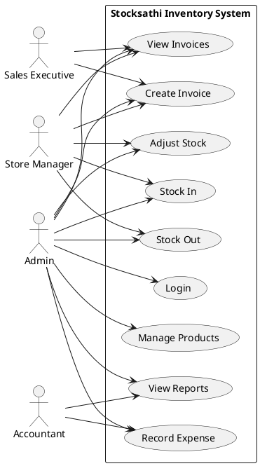
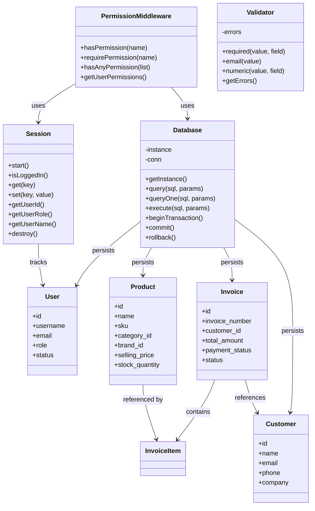
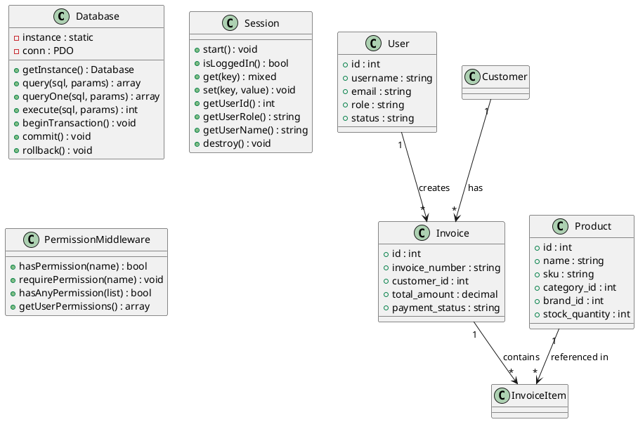
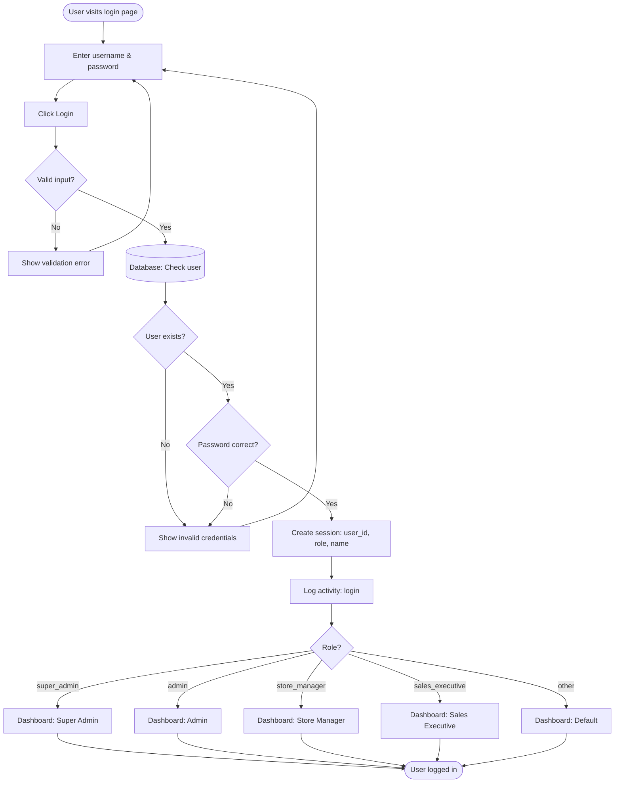
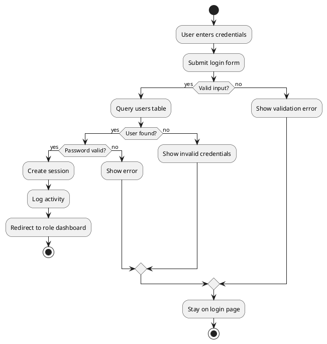
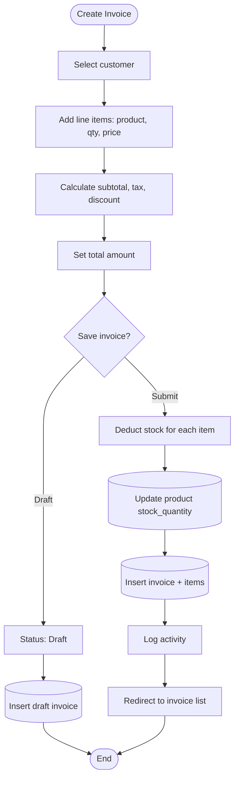
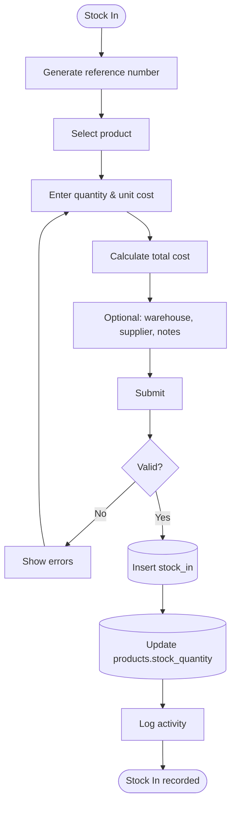

# Stocksathi – System Design & Database Documentation

**Project:** Stocksathi Inventory Management System  
**Target:** Small & Medium Enterprises (SMEs)  
**Version:** 2.0  
**Last Updated:** 2026

---

## Table of Contents

1. [6. System Design & Database Development](#6-system-design--database-development)
2. [7. UML Diagrams](#7-uml-diagrams)
   - [7.1 Use Case Diagram](#71-use-case-diagram)
   - [7.2 Class Diagram](#72-class-diagram)
   - [7.3 Activity Diagram](#73-activity-diagram)
3. [8. Data Dictionary](#8-data-dictionary)
4. [9. Finalized Database Schema](#9-finalized-database-schema)

---

## 6. System Design & Database Development

### 6.1 System Overview

Stocksathi is a **web-based inventory management system** for SMEs. It supports:

- **Stock control** – Stock In, Stock Out, Adjustments, Transfers  
- **Product management** – Categories, Brands, Products (CRUD)  
- **Sales & billing** – Invoices, Quotations, Sales Returns  
- **Customers & suppliers** – Master data and linkage to sales  
- **Finance** – Basic expense tracking and promotions  
- **User management** – Roles, permissions, activity logs  

### 6.2 Architecture

**3-Tier Architecture**

| Tier | Technology | Responsibility |
|------|------------|----------------|
| **Presentation** | HTML, CSS, JavaScript | UI, forms, dashboards, theme |
| **Business Logic** | PHP | Session, RBAC, validation, workflows |
| **Data** | MySQL | Persistence, transactions, constraints |

**Directory Structure (Logical Layers)**

```
stocksathi/
├── pages/           # Presentation – views, forms, dashboards
├── _includes/       # Business logic – Database, Session, Auth, RBAC
├── css/, js/        # Presentation assets
├── migrations/      # Database schema & RBAC scripts
└── stocksathi_complete.sql   # Full schema + sample data
```

### 6.3 Database Development Approach

1. **Requirements** – SME inventory, sales, finance, HR, multi-role access.  
2. **Conceptual design** – Entities: Users, Products, Stock, Invoices, Customers, etc.  
3. **Logical design** – Normalized tables (3NF), keys, relationships.  
4. **Physical design** – MySQL InnoDB, utf8mb4, indexes, foreign keys.  
5. **Implementation** – `stocksathi_complete.sql` plus migrations for RBAC/stock logs.

### 6.4 Module Summary

| Module | Purpose | Key Tables |
|--------|---------|------------|
| Authentication & Authorization | Login, roles, permissions | `users`, `roles` |
| Product Management | Categories, brands, products | `categories`, `brands`, `products` |
| Stock Management | Warehouses, stock in/out, adjustments, transfers | `warehouses`, `stores`, `stock_in`, `stock_out`, `stock_adjustments`, `stock_transfers` |
| Customers & Suppliers | Party master data | `customers`, `suppliers` |
| Sales | Invoices, quotations, returns | `invoices`, `invoice_items`, `quotations`, `quotation_items`, `sales_returns`, `sales_return_items` |
| Finance | Expenses, promotions | `expenses`, `promotions` |
| HRM | Departments, employees, attendance, leave | `departments`, `employees`, `attendance`, `leave_requests` |
| System | Logs, settings | `activity_logs`, `settings` |

### 6.5 User Roles & Access

| Role | Access |
|------|--------|
| **super_admin** | Full system access |
| **admin** | Business operations, most settings |
| **store_manager** | Store ops, stock, sales |
| **sales_executive** | Sales, invoices, customers |
| **accountant** | Finance, expenses, reports |
| **user** | Basic sales, products |

Access is enforced via **PermissionMiddleware** (server-side) and **sidebar** (UI).

---

## 7. UML Diagrams

### 7.1 Use Case Diagram

**Actors:** Admin, Store Manager, Sales Executive, Accountant, System.

**Use cases (grouped by module):**

- **Auth:** Login, Logout, Manage Users, Assign Roles  
- **Products:** Manage Categories, Manage Brands, Manage Products  
- **Stock:** Stock In, Stock Out, Adjust Stock, Transfer Stock, Manage Warehouses  
- **Sales:** Create Invoice, View Invoices, Create Quotation, Process Returns  
- **People:** Manage Customers, Manage Suppliers  
- **Finance:** Record Expense, View Expenses, Manage Promotions  
- **HR:** Manage Employees, Manage Departments, Record Attendance, Manage Leave  
- **System:** View Reports, View Activity Logs, Manage Settings  

**Mermaid – Use Case Diagram (simplified)**

```mermaid
flowchart TB
    subgraph Actors
        A[Admin]
        SM[Store Manager]
        SE[Sales Executive]
        ACC[Accountant]
    end

    subgraph Authentication
        UC1[Login]
        UC2[Logout]
        UC3[Manage Users]
    end

    subgraph Product Management
        UC4[Manage Categories]
        UC5[Manage Brands]
        UC6[Manage Products]
    end

    subgraph Stock Management
        UC7[Stock In]
        UC8[Stock Out]
        UC9[Adjust Stock]
        UC10[Transfer Stock]
    end

    subgraph Sales
        UC11[Create Invoice]
        UC12[View Invoices]
        UC13[Create Quotation]
        UC14[Process Returns]
    end

    subgraph Finance
        UC15[Record Expense]
        UC16[View Expenses]
    end

    A --> UC1 & UC2 & UC3 & UC4 & UC5 & UC6
    A --> UC7 & UC8 & UC9 & UC10 & UC11 & UC12 & UC13 & UC14
    A --> UC15 & UC16
    SM --> UC7 & UC8 & UC9 & UC10 & UC11 & UC12
    SE --> UC11 & UC12 & UC13
    ACC --> UC15 & UC16
```



**PlantUML – Use Case (alternative)**



---

### 7.2 Class Diagram

**Main classes (PHP layer):**

- **Database** – Singleton, PDO connection, `query`, `queryOne`, `execute`, transactions.  
- **Session** – `start`, `isLoggedIn`, `get`, `set`, `getUserId`, `getUserRole`, `getUserName`, `destroy`.  
- **PermissionMiddleware** – `hasPermission`, `requirePermission`, `hasAnyPermission`, `getUserPermissions`.  
- **Validator** – `required`, `email`, `minLength`, `numeric`, `getErrors`.  
- **RoleManager** – Role CRUD, assignment.  
- **AuthHelper** – Login helpers, password checks.

**Entity classes (conceptual – map to DB tables):**

- **User** – id, username, email, password, full_name, role, status, …  
- **Role** – id, name, display_name, permissions, …  
- **Category** – id, name, description, parent_id, status, …  
- **Brand** – id, name, description, status, …  
- **Product** – id, name, sku, category_id, brand_id, prices, stock_quantity, …  
- **Customer** – id, name, email, phone, company, address, …  
- **Supplier** – id, name, email, phone, company, …  
- **Invoice** – id, invoice_number, customer_id, dates, amounts, payment_status, …  
- **InvoiceItem** – id, invoice_id, product_id, quantity, unit_price, line_total, …  
- **StockIn** – id, reference_no, product_id, quantity, unit_cost, status, …  
- **StockOut** – id, reference_no, product_id, quantity, reason, status, …  
- **Expense** – id, expense_number, category, amount, expense_date, status, …

**Mermaid – Class Diagram (simplified)**



**PlantUML – Class Diagram (alternative)**



---

### 7.3 Activity Diagram

**Examples:** Login flow, Create Invoice flow, Stock In flow.

#### 7.3.1 Login Activity Diagram

**Mermaid**



**PlantUML**



#### 7.3.2 Create Invoice Activity Diagram

**Mermaid**



#### 7.3.3 Stock In Activity Diagram

**Mermaid**



---

## 8. Data Dictionary

### 8.1 Authentication & Authorization

#### users

| Column | Type | Null | Key | Default | Description |
|--------|------|------|-----|---------|-------------|
| id | int(11) | NO | PRI | AUTO_INCREMENT | Primary key |
| username | varchar(50) | NO | UNI | - | Login name, unique |
| email | varchar(100) | NO | UNI | - | Email, unique |
| password | varchar(255) | NO | - | - | Hashed password |
| full_name | varchar(100) | YES | - | NULL | Display name |
| role | varchar(20) | YES | MUL | 'user' | Role name |
| phone | varchar(20) | YES | - | NULL | Phone |
| address | text | YES | - | NULL | Address |
| status | enum | YES | MUL | 'active' | active, inactive, suspended |
| created_at | timestamp | NO | - | CURRENT_TIMESTAMP | Created at |
| updated_at | timestamp | YES | - | NULL ON UPDATE | Updated at |
| last_login | timestamp | YES | - | NULL | Last login time |

#### roles

| Column | Type | Null | Key | Default | Description |
|--------|------|------|-----|---------|-------------|
| id | int(11) | NO | PRI | AUTO_INCREMENT | Primary key |
| name | varchar(50) | NO | UNI | - | Role identifier |
| display_name | varchar(100) | NO | - | - | Display label |
| description | text | YES | - | NULL | Role description |
| permissions | text | YES | - | NULL | JSON permissions |
| created_at | timestamp | NO | - | CURRENT_TIMESTAMP | Created at |

---

### 8.2 Product Management

#### categories

| Column | Type | Null | Key | Default | Description |
|--------|------|------|-----|---------|-------------|
| id | int(11) | NO | PRI | AUTO_INCREMENT | Primary key |
| name | varchar(100) | NO | UNI | - | Category name |
| description | text | YES | - | NULL | Description |
| parent_id | int(11) | YES | MUL | NULL | Parent category |
| status | enum | YES | - | 'active' | active, inactive |
| created_at | timestamp | NO | - | CURRENT_TIMESTAMP | Created at |
| updated_at | timestamp | YES | - | NULL ON UPDATE | Updated at |

#### brands

| Column | Type | Null | Key | Default | Description |
|--------|------|------|-----|---------|-------------|
| id | int(11) | NO | PRI | AUTO_INCREMENT | Primary key |
| name | varchar(100) | NO | UNI | - | Brand name |
| description | text | YES | - | NULL | Description |
| logo | varchar(255) | YES | - | NULL | Logo path |
| status | enum | YES | - | 'active' | active, inactive |
| created_at | timestamp | NO | - | CURRENT_TIMESTAMP | Created at |
| updated_at | timestamp | YES | - | NULL ON UPDATE | Updated at |

#### products

| Column | Type | Null | Key | Default | Description |
|--------|------|------|-----|---------|-------------|
| id | int(11) | NO | PRI | AUTO_INCREMENT | Primary key |
| name | varchar(200) | NO | - | - | Product name |
| sku | varchar(100) | YES | UNI | NULL | Stock keeping unit |
| barcode | varchar(100) | YES | UNI | NULL | Barcode |
| description | text | YES | - | NULL | Description |
| category_id | int(11) | YES | MUL,FK | NULL | FK → categories |
| brand_id | int(11) | YES | MUL,FK | NULL | FK → brands |
| unit | varchar(20) | YES | - | 'pcs' | Unit of measure |
| purchase_price | decimal(10,2) | YES | - | 0.00 | Purchase price |
| selling_price | decimal(10,2) | YES | - | 0.00 | Selling price |
| tax_rate | decimal(5,2) | YES | - | 0.00 | Tax rate % |
| stock_quantity | int(11) | YES | - | 0 | Current stock |
| min_stock_level | int(11) | YES | - | 10 | Min stock |
| max_stock_level | int(11) | YES | - | 1000 | Max stock |
| reorder_level | int(11) | YES | - | 20 | Reorder threshold |
| image | varchar(255) | YES | - | NULL | Image path |
| status | enum | YES | MUL | 'active' | active, inactive, discontinued |
| created_at | timestamp | NO | - | CURRENT_TIMESTAMP | Created at |
| updated_at | timestamp | YES | - | NULL ON UPDATE | Updated at |

---

### 8.3 Stock Management

#### warehouses

| Column | Type | Null | Key | Default | Description |
|--------|------|------|-----|---------|-------------|
| id | int(11) | NO | PRI | AUTO_INCREMENT | Primary key |
| name | varchar(100) | NO | - | - | Warehouse name |
| code | varchar(50) | YES | UNI | NULL | Warehouse code |
| address | text | YES | - | NULL | Address |
| city | varchar(100) | YES | - | NULL | City |
| state | varchar(100) | YES | - | NULL | State |
| pincode | varchar(10) | YES | - | NULL | PIN |
| phone | varchar(20) | YES | - | NULL | Phone |
| email | varchar(100) | YES | - | NULL | Email |
| manager_id | int(11) | YES | MUL | NULL | Manager user ID |
| capacity | int(11) | YES | - | NULL | Capacity |
| status | enum | YES | - | 'active' | active, inactive |
| created_at | timestamp | NO | - | CURRENT_TIMESTAMP | Created at |
| updated_at | timestamp | YES | - | NULL ON UPDATE | Updated at |

#### stock_in

| Column | Type | Null | Key | Default | Description |
|--------|------|------|-----|---------|-------------|
| id | int(11) | NO | PRI | AUTO_INCREMENT | Primary key |
| reference_no | varchar(50) | NO | - | - | Reference number |
| product_id | int(11) | NO | MUL,FK | - | FK → products |
| warehouse_id | int(11) | YES | MUL | NULL | Warehouse |
| supplier_id | int(11) | YES | MUL | NULL | Supplier |
| quantity | int(11) | NO | - | - | Quantity received |
| unit_cost | decimal(10,2) | YES | - | 0.00 | Unit cost |
| total_cost | decimal(10,2) | YES | - | 0.00 | Total cost |
| notes | text | YES | - | NULL | Notes |
| received_by | int(11) | YES | MUL | NULL | User ID |
| received_date | date | YES | - | NULL | Received date |
| status | enum | YES | - | 'pending' | pending, completed, cancelled |
| created_at | timestamp | NO | - | CURRENT_TIMESTAMP | Created at |
| updated_at | timestamp | YES | - | NULL ON UPDATE | Updated at |

#### stock_out

| Column | Type | Null | Key | Default | Description |
|--------|------|------|-----|---------|-------------|
| id | int(11) | NO | PRI | AUTO_INCREMENT | Primary key |
| reference_no | varchar(50) | NO | - | - | Reference number |
| product_id | int(11) | NO | MUL,FK | - | FK → products |
| warehouse_id | int(11) | YES | MUL | NULL | Warehouse |
| quantity | int(11) | NO | - | - | Quantity issued |
| unit_cost | decimal(10,2) | YES | - | 0.00 | Unit cost |
| total_cost | decimal(10,2) | YES | - | 0.00 | Total cost |
| reason | varchar(200) | YES | - | NULL | Reason |
| notes | text | YES | - | NULL | Notes |
| issued_by | int(11) | YES | MUL | NULL | User ID |
| issued_date | date | YES | - | NULL | Issued date |
| status | enum | YES | - | 'pending' | pending, completed, cancelled |
| created_at | timestamp | NO | - | CURRENT_TIMESTAMP | Created at |
| updated_at | timestamp | YES | - | NULL ON UPDATE | Updated at |

#### stock_adjustments

| Column | Type | Null | Key | Default | Description |
|--------|------|------|-----|---------|-------------|
| id | int(11) | NO | PRI | AUTO_INCREMENT | Primary key |
| reference_no | varchar(50) | NO | - | - | Reference number |
| product_id | int(11) | NO | MUL,FK | - | FK → products |
| warehouse_id | int(11) | YES | MUL | NULL | Warehouse |
| type | enum | NO | - | - | addition, subtraction |
| quantity | int(11) | NO | - | - | Quantity |
| reason | varchar(200) | YES | - | NULL | Reason |
| notes | text | YES | - | NULL | Notes |
| adjusted_by | int(11) | YES | MUL | NULL | User ID |
| adjustment_date | date | YES | - | NULL | Date |
| created_at | timestamp | NO | - | CURRENT_TIMESTAMP | Created at |
| updated_at | timestamp | YES | - | NULL ON UPDATE | Updated at |

#### stock_transfers

| Column | Type | Null | Key | Default | Description |
|--------|------|------|-----|---------|-------------|
| id | int(11) | NO | PRI | AUTO_INCREMENT | Primary key |
| reference_no | varchar(50) | NO | - | - | Reference number |
| product_id | int(11) | NO | MUL,FK | - | FK → products |
| from_warehouse_id | int(11) | NO | MUL | - | Source warehouse |
| to_warehouse_id | int(11) | NO | MUL | - | Destination warehouse |
| quantity | int(11) | NO | - | - | Quantity |
| notes | text | YES | - | NULL | Notes |
| transferred_by | int(11) | YES | MUL | NULL | User ID |
| transfer_date | date | YES | - | NULL | Transfer date |
| status | enum | YES | - | 'pending' | pending, in-transit, completed, cancelled |
| created_at | timestamp | NO | - | CURRENT_TIMESTAMP | Created at |
| updated_at | timestamp | YES | - | NULL ON UPDATE | Updated at |

---

### 8.4 Customers & Suppliers

#### customers

| Column | Type | Null | Key | Default | Description |
|--------|------|------|-----|---------|-------------|
| id | int(11) | NO | PRI | AUTO_INCREMENT | Primary key |
| name | varchar(100) | NO | - | - | Customer name |
| email | varchar(100) | YES | UNI | NULL | Email |
| phone | varchar(20) | YES | MUL | NULL | Phone |
| company | varchar(100) | YES | - | NULL | Company |
| address | text | YES | - | NULL | Address |
| city | varchar(100) | YES | - | NULL | City |
| state | varchar(100) | YES | - | NULL | State |
| pincode | varchar(10) | YES | - | NULL | PIN |
| gst_number | varchar(50) | YES | - | NULL | GST |
| credit_limit | decimal(10,2) | YES | - | 0.00 | Credit limit |
| outstanding_balance | decimal(10,2) | YES | - | 0.00 | Outstanding |
| status | enum | YES | MUL | 'active' | active, inactive, blocked |
| created_at | timestamp | NO | - | CURRENT_TIMESTAMP | Created at |
| updated_at | timestamp | YES | - | NULL ON UPDATE | Updated at |

#### suppliers

| Column | Type | Null | Key | Default | Description |
|--------|------|------|-----|---------|-------------|
| id | int(11) | NO | PRI | AUTO_INCREMENT | Primary key |
| name | varchar(100) | NO | - | - | Supplier name |
| email | varchar(100) | YES | UNI | NULL | Email |
| phone | varchar(20) | YES | MUL | NULL | Phone |
| company | varchar(100) | YES | - | NULL | Company |
| address | text | YES | - | NULL | Address |
| city | varchar(100) | YES | - | NULL | City |
| state | varchar(100) | YES | - | NULL | State |
| pincode | varchar(10) | YES | - | NULL | PIN |
| gst_number | varchar(50) | YES | - | NULL | GST |
| bank_name | varchar(100) | YES | - | NULL | Bank name |
| bank_account | varchar(50) | YES | - | NULL | Bank account |
| ifsc_code | varchar(20) | YES | - | NULL | IFSC |
| payment_terms | varchar(100) | YES | - | NULL | Payment terms |
| outstanding_balance | decimal(10,2) | YES | - | 0.00 | Outstanding |
| status | enum | YES | MUL | 'active' | active, inactive, blocked |
| created_at | timestamp | NO | - | CURRENT_TIMESTAMP | Created at |
| updated_at | timestamp | YES | - | NULL ON UPDATE | Updated at |

---

### 8.5 Sales

#### invoices

| Column | Type | Null | Key | Default | Description |
|--------|------|------|-----|---------|-------------|
| id | int(11) | NO | PRI | AUTO_INCREMENT | Primary key |
| invoice_number | varchar(50) | NO | UNI | - | Invoice number |
| customer_id | int(11) | YES | MUL,FK | NULL | FK → customers |
| invoice_date | date | NO | MUL | - | Invoice date |
| due_date | date | YES | - | NULL | Due date |
| subtotal | decimal(10,2) | YES | - | 0.00 | Subtotal |
| tax_amount | decimal(10,2) | YES | - | 0.00 | Tax |
| discount_amount | decimal(10,2) | YES | - | 0.00 | Discount |
| shipping_amount | decimal(10,2) | YES | - | 0.00 | Shipping |
| total_amount | decimal(10,2) | YES | - | 0.00 | Total |
| paid_amount | decimal(10,2) | YES | - | 0.00 | Paid |
| balance_amount | decimal(10,2) | YES | - | 0.00 | Balance |
| payment_status | enum | YES | MUL | 'unpaid' | unpaid, partial, paid, overdue |
| payment_method | varchar(50) | YES | - | NULL | Payment method |
| notes | text | YES | - | NULL | Notes |
| terms_conditions | text | YES | - | NULL | T&C |
| created_by | int(11) | YES | - | NULL | User ID |
| status | enum | YES | - | 'draft' | draft, sent, paid, cancelled |
| created_at | timestamp | NO | - | CURRENT_TIMESTAMP | Created at |
| updated_at | timestamp | YES | - | NULL ON UPDATE | Updated at |

#### invoice_items

| Column | Type | Null | Key | Default | Description |
|--------|------|------|-----|---------|-------------|
| id | int(11) | NO | PRI | AUTO_INCREMENT | Primary key |
| invoice_id | int(11) | NO | MUL,FK | - | FK → invoices |
| product_id | int(11) | NO | MUL,FK | - | FK → products |
| product_name | varchar(200) | NO | - | - | Product name snapshot |
| quantity | int(11) | NO | - | - | Quantity |
| unit_price | decimal(10,2) | NO | - | - | Unit price |
| tax_rate | decimal(5,2) | YES | - | 0.00 | Tax rate % |
| tax_amount | decimal(10,2) | YES | - | 0.00 | Tax amount |
| discount_rate | decimal(5,2) | YES | - | 0.00 | Discount % |
| discount_amount | decimal(10,2) | YES | - | 0.00 | Discount amount |
| line_total | decimal(10,2) | NO | - | - | Line total |

---

### 8.6 Finance

#### expenses

| Column | Type | Null | Key | Default | Description |
|--------|------|------|-----|---------|-------------|
| id | int(11) | NO | PRI | AUTO_INCREMENT | Primary key |
| expense_number | varchar(50) | NO | UNI | - | Expense reference |
| category | varchar(100) | NO | MUL | - | Expense category |
| amount | decimal(10,2) | NO | - | - | Amount |
| expense_date | date | NO | MUL | - | Expense date |
| payment_method | varchar(50) | YES | - | NULL | Payment method |
| vendor | varchar(100) | YES | - | NULL | Vendor |
| description | text | YES | - | NULL | Description |
| receipt | varchar(255) | YES | - | NULL | Receipt path |
| status | enum | YES | MUL | 'pending' | pending, approved, rejected, paid |
| approved_by | int(11) | YES | - | NULL | Approver user ID |
| created_by | int(11) | YES | - | NULL | Creator user ID |
| created_at | timestamp | NO | - | CURRENT_TIMESTAMP | Created at |
| updated_at | timestamp | YES | - | NULL ON UPDATE | Updated at |

#### promotions

| Column | Type | Null | Key | Default | Description |
|--------|------|------|-----|---------|-------------|
| id | int(11) | NO | PRI | AUTO_INCREMENT | Primary key |
| name | varchar(100) | NO | - | - | Promotion name |
| code | varchar(50) | YES | UNI | NULL | Coupon code |
| type | enum | NO | - | - | percentage, fixed, buy_x_get_y |
| value | decimal(10,2) | NO | - | - | Discount value |
| min_purchase_amount | decimal(10,2) | YES | - | 0.00 | Min purchase |
| max_discount_amount | decimal(10,2) | YES | - | NULL | Max discount |
| start_date | date | NO | MUL | - | Start date |
| end_date | date | NO | MUL | - | End date |
| usage_limit | int(11) | YES | - | NULL | Usage limit |
| used_count | int(11) | YES | - | 0 | Times used |
| applicable_products | text | YES | - | NULL | Product IDs (JSON) |
| applicable_categories | text | YES | - | NULL | Category IDs (JSON) |
| description | text | YES | - | NULL | Description |
| status | enum | YES | MUL | 'active' | active, inactive, expired |
| created_at | timestamp | NO | - | CURRENT_TIMESTAMP | Created at |
| updated_at | timestamp | YES | - | NULL ON UPDATE | Updated at |

---

### 8.7 HRM

#### departments

| Column | Type | Null | Key | Default | Description |
|--------|------|------|-----|---------|-------------|
| id | int(11) | NO | PRI | AUTO_INCREMENT | Primary key |
| name | varchar(100) | NO | UNI | - | Department name |
| code | varchar(50) | YES | UNI | NULL | Department code |
| description | text | YES | - | NULL | Description |
| manager_id | int(11) | YES | - | NULL | Manager user ID |
| status | enum | YES | - | 'active' | active, inactive |
| created_at | timestamp | NO | - | CURRENT_TIMESTAMP | Created at |
| updated_at | timestamp | YES | - | NULL ON UPDATE | Updated at |

#### employees

| Column | Type | Null | Key | Default | Description |
|--------|------|------|-----|---------|-------------|
| id | int(11) | NO | PRI | AUTO_INCREMENT | Primary key |
| employee_code | varchar(50) | NO | UNI | - | Employee code |
| user_id | int(11) | YES | MUL,FK | NULL | FK → users |
| first_name | varchar(50) | NO | - | - | First name |
| last_name | varchar(50) | NO | - | - | Last name |
| email | varchar(100) | NO | UNI | - | Email |
| phone | varchar(20) | YES | - | NULL | Phone |
| department_id | int(11) | YES | MUL,FK | NULL | FK → departments |
| designation | varchar(100) | YES | - | NULL | Designation |
| date_of_birth | date | YES | - | NULL | DOB |
| date_of_joining | date | YES | - | NULL | DOJ |
| gender | enum | YES | - | NULL | male, female, other |
| address | text | YES | - | NULL | Address |
| city | varchar(100) | YES | - | NULL | City |
| state | varchar(100) | YES | - | NULL | State |
| pincode | varchar(10) | YES | - | NULL | PIN |
| salary | decimal(10,2) | YES | - | 0.00 | Salary |
| status | enum | YES | - | 'active' | active, on_leave, resigned, terminated |
| created_at | timestamp | NO | - | CURRENT_TIMESTAMP | Created at |
| updated_at | timestamp | YES | - | NULL ON UPDATE | Updated at |

#### attendance

| Column | Type | Null | Key | Default | Description |
|--------|------|------|-----|---------|-------------|
| id | int(11) | NO | PRI | AUTO_INCREMENT | Primary key |
| employee_id | int(11) | NO | MUL,FK | - | FK → employees |
| date | date | NO | MUL | - | Attendance date |
| check_in | time | YES | - | NULL | Check-in |
| check_out | time | YES | - | NULL | Check-out |
| total_hours | decimal(5,2) | YES | - | 0.00 | Total hours |
| overtime_hours | decimal(5,2) | YES | - | 0.00 | OT hours |
| status | enum | YES | MUL | 'present' | present, absent, half_day, on_leave, holiday |
| notes | text | YES | - | NULL | Notes |
| created_at | timestamp | NO | - | CURRENT_TIMESTAMP | Created at |
| updated_at | timestamp | YES | - | NULL ON UPDATE | Updated at |

#### leave_requests

| Column | Type | Null | Key | Default | Description |
|--------|------|------|-----|---------|-------------|
| id | int(11) | NO | PRI | AUTO_INCREMENT | Primary key |
| employee_id | int(11) | NO | MUL,FK | - | FK → employees |
| leave_type | enum | NO | - | - | casual, sick, earned, maternity, paternity, unpaid |
| from_date | date | NO | MUL | - | From date |
| to_date | date | NO | MUL | - | To date |
| total_days | int(11) | NO | - | - | Total days |
| reason | text | NO | - | - | Reason |
| status | enum | YES | MUL | 'pending' | pending, approved, rejected, cancelled |
| approved_by | int(11) | YES | - | NULL | Approver user ID |
| approval_date | date | YES | - | NULL | Approval date |
| rejection_reason | text | YES | - | NULL | Rejection reason |
| created_at | timestamp | NO | - | CURRENT_TIMESTAMP | Created at |
| updated_at | timestamp | YES | - | NULL ON UPDATE | Updated at |

---

### 8.8 System

#### activity_logs

| Column | Type | Null | Key | Default | Description |
|--------|------|------|-----|---------|-------------|
| id | int(11) | NO | PRI | AUTO_INCREMENT | Primary key |
| user_id | int(11) | YES | MUL | NULL | User ID |
| module | varchar(50) | YES | MUL | NULL | Module name |
| action | varchar(100) | YES | - | NULL | Action |
| description | text | YES | - | NULL | Description |
| ip_address | varchar(45) | YES | - | NULL | IP |
| user_agent | text | YES | - | NULL | User agent |
| created_at | timestamp | NO | MUL | CURRENT_TIMESTAMP | Created at |

#### settings

| Column | Type | Null | Key | Default | Description |
|--------|------|------|-----|---------|-------------|
| id | int(11) | NO | PRI | AUTO_INCREMENT | Primary key |
| key | varchar(100) | NO | UNI | - | Setting key |
| value | text | YES | - | NULL | Value |
| type | varchar(20) | YES | - | 'string' | string, number, etc. |
| group | varchar(50) | YES | MUL | 'general' | Setting group |
| description | text | YES | - | NULL | Description |
| updated_at | timestamp | YES | - | NULL ON UPDATE | Updated at |

---

### 8.9 Stores

#### stores

| Column | Type | Null | Key | Default | Description |
|--------|------|------|-----|---------|-------------|
| id | int(11) | NO | PRI | AUTO_INCREMENT | Primary key |
| name | varchar(100) | NO | - | - | Store name |
| code | varchar(50) | YES | UNI | NULL | Store code |
| address | text | YES | - | NULL | Address |
| city | varchar(100) | YES | - | NULL | City |
| state | varchar(100) | YES | - | NULL | State |
| pincode | varchar(10) | YES | - | NULL | PIN |
| phone | varchar(20) | YES | - | NULL | Phone |
| email | varchar(100) | YES | - | NULL | Email |
| manager_id | int(11) | YES | MUL | NULL | Manager user ID |
| status | enum | YES | - | 'active' | active, inactive |
| created_at | timestamp | NO | - | CURRENT_TIMESTAMP | Created at |
| updated_at | timestamp | YES | - | NULL ON UPDATE | Updated at |

---

### 8.10 Quotations & Sales Returns

#### quotations

| Column | Type | Null | Key | Default | Description |
|--------|------|------|-----|---------|-------------|
| id | int(11) | NO | PRI | AUTO_INCREMENT | Primary key |
| quotation_number | varchar(50) | NO | UNI | - | Quotation number |
| customer_id | int(11) | YES | MUL,FK | NULL | FK → customers |
| quotation_date | date | NO | MUL | - | Quotation date |
| valid_until | date | YES | - | NULL | Valid until |
| subtotal | decimal(10,2) | YES | - | 0.00 | Subtotal |
| tax_amount | decimal(10,2) | YES | - | 0.00 | Tax |
| discount_amount | decimal(10,2) | YES | - | 0.00 | Discount |
| total_amount | decimal(10,2) | YES | - | 0.00 | Total |
| notes | text | YES | - | NULL | Notes |
| terms_conditions | text | YES | - | NULL | T&C |
| created_by | int(11) | YES | - | NULL | User ID |
| status | enum | YES | MUL | 'draft' | draft, sent, accepted, rejected, expired, converted |
| created_at | timestamp | NO | - | CURRENT_TIMESTAMP | Created at |
| updated_at | timestamp | YES | - | NULL ON UPDATE | Updated at |

#### quotation_items

| Column | Type | Null | Key | Default | Description |
|--------|------|------|-----|---------|-------------|
| id | int(11) | NO | PRI | AUTO_INCREMENT | Primary key |
| quotation_id | int(11) | NO | MUL,FK | - | FK → quotations |
| product_id | int(11) | NO | MUL,FK | - | FK → products |
| product_name | varchar(200) | NO | - | - | Product name snapshot |
| quantity | int(11) | NO | - | - | Quantity |
| unit_price | decimal(10,2) | NO | - | - | Unit price |
| tax_rate | decimal(5,2) | YES | - | 0.00 | Tax rate % |
| tax_amount | decimal(10,2) | YES | - | 0.00 | Tax amount |
| discount_rate | decimal(5,2) | YES | - | 0.00 | Discount % |
| discount_amount | decimal(10,2) | YES | - | 0.00 | Discount amount |
| line_total | decimal(10,2) | NO | - | - | Line total |

#### sales_returns

| Column | Type | Null | Key | Default | Description |
|--------|------|------|-----|---------|-------------|
| id | int(11) | NO | PRI | AUTO_INCREMENT | Primary key |
| return_number | varchar(50) | NO | UNI | - | Return reference |
| invoice_id | int(11) | YES | MUL,FK | NULL | FK → invoices |
| customer_id | int(11) | YES | MUL,FK | NULL | FK → customers |
| return_date | date | NO | MUL | - | Return date |
| total_amount | decimal(10,2) | YES | - | 0.00 | Total |
| refund_amount | decimal(10,2) | YES | - | 0.00 | Refund |
| refund_method | varchar(50) | YES | - | NULL | Refund method |
| reason | varchar(200) | YES | - | NULL | Reason |
| notes | text | YES | - | NULL | Notes |
| processed_by | int(11) | YES | - | NULL | User ID |
| status | enum | YES | MUL | 'pending' | pending, approved, rejected, refunded |
| created_at | timestamp | NO | - | CURRENT_TIMESTAMP | Created at |
| updated_at | timestamp | YES | - | NULL ON UPDATE | Updated at |

#### sales_return_items

| Column | Type | Null | Key | Default | Description |
|--------|------|------|-----|---------|-------------|
| id | int(11) | NO | PRI | AUTO_INCREMENT | Primary key |
| return_id | int(11) | NO | MUL,FK | - | FK → sales_returns |
| product_id | int(11) | NO | MUL,FK | - | FK → products |
| product_name | varchar(200) | NO | - | - | Product name snapshot |
| quantity | int(11) | NO | - | - | Quantity returned |
| unit_price | decimal(10,2) | NO | - | - | Unit price |
| line_total | decimal(10,2) | NO | - | - | Line total |

---

## 9. Finalized Database Schema

### 9.1 Schema Overview

- **Database name:** `stocksathi`  
- **Engine:** InnoDB  
- **Character set:** utf8mb4  
- **Collation:** utf8mb4_unicode_ci  

### 9.2 Entity–Relationship Summary

```
users 1───* activity_logs
users 1───* invoices (created_by)
roles 1───* users (role → roles.name)

categories 1───* products
brands 1───* products

products 1───* stock_in
products 1───* stock_out
products 1───* stock_adjustments
products 1───* stock_transfers
products 1───* invoice_items
products 1───* quotation_items
products 1───* sales_return_items

customers 1───* invoices
customers 1───* quotations
customers 1───* sales_returns

invoices 1───* invoice_items
invoices 1───* sales_returns (optional)

departments 1───* employees
users 1───1 employees (optional)
employees 1───* attendance
employees 1───* leave_requests
```

### 9.3 Key Conventions

- **Primary keys:** `id` (int, AUTO_INCREMENT) for all main tables.  
- **Timestamps:** `created_at`, `updated_at` where applicable.  
- **Soft delete:** Use `status` (e.g. inactive, discontinued) instead of hard deletes where required.  
- **Foreign keys:** Defined for product, customer, invoice, employee, department links; ON DELETE CASCADE/SET NULL as per design.  
- **Unique keys:** `username`, `email` (users); `sku`, `barcode` (products); `invoice_number`; `expense_number`; etc.  
- **Indexes:** On role, status, dates, and foreign key columns for query performance.

### 9.4 Schema File Reference

| File | Purpose |
|------|---------|
| `stocksathi_complete.sql` | Full schema + sample data (categories, brands, products, users, roles, etc.) |
| `migrations/setup_rbac.sql` | RBAC tables (e.g. permissions, role_permissions) if used |
| `migrations/create_stock_logs.sql` | Stock audit/log tables if used |
| `migrations/demo_data.sql` | Additional demo data |

### 9.5 Table Count by Module

| Module | Tables |
|--------|--------|
| Authentication & Authorization | 2 (users, roles) |
| Product Management | 3 (categories, brands, products) |
| Stock Management | 6 (warehouses, stores, stock_in, stock_out, stock_adjustments, stock_transfers) |
| Customers & Suppliers | 2 (customers, suppliers) |
| Sales | 6 (invoices, invoice_items, quotations, quotation_items, sales_returns, sales_return_items) |
| Finance | 2 (expenses, promotions) |
| HRM | 4 (departments, employees, attendance, leave_requests) |
| System | 2 (activity_logs, settings) |
| **Total** | **27** (core schema) |

---

## Appendix: Diagram Tools

- **Mermaid:** Renders in GitHub, GitLab, VS Code (with extension), and many Markdown viewers. Copy the ` ```mermaid ` blocks into [Mermaid Live](https://mermaid.live) to edit or export.
- **PlantUML:** Use [plantuml.com](https://www.plantuml.com/plantuml) or the VS Code PlantUML extension. Standalone `.puml` files are in **`docs/uml/`**: `01-use-case-diagram.puml`, `02-class-diagram.puml`, `03-activity-login.puml`, `04-activity-create-invoice.puml`, `05-activity-stock-in.puml`.

---

*End of System Design & Database Documentation*
