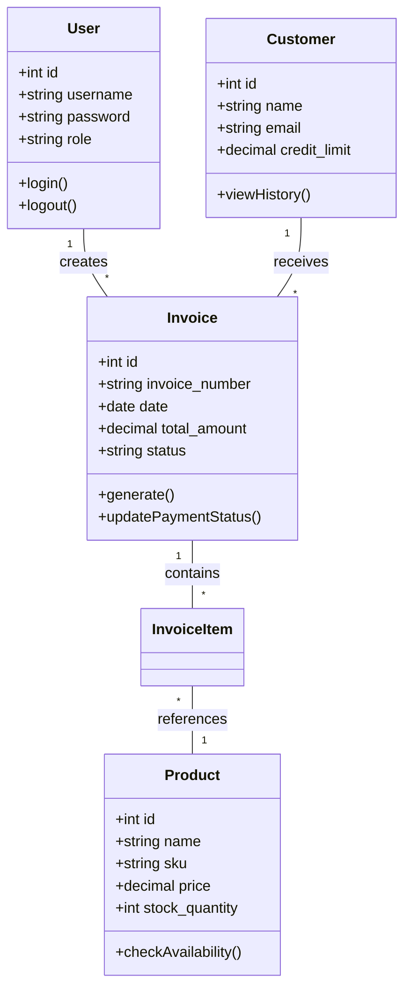
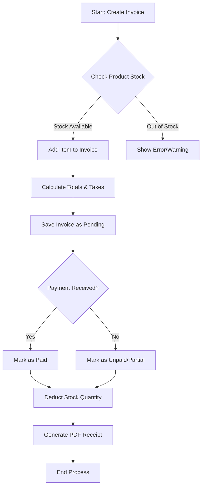

# REPORTING-2: System Design & Documentation

## 6. System Design & Database Development

### 6.1. System Architecture
The **StockSathi** application follows a robust **Three-Tier Architecture** integrated within a classical LAMP stack environment. This design ensures separation of concerns, scalability, and maintainability.

*   **Presentation Layer (Frontend):** 
    *   Built using **HTML5, CSS3 (Custom Design System), and JavaScript**.
    *   Features a responsive User Interface (UI) with a "Teal" professional color scheme.
    *   Utilizes **Chart.js** for dynamic data visualization in dashboards.
*   **Application Layer (Backend):**
    *   Developed in **Core PHP** (Object-Oriented Design).
    *   Implements **Middleware Pattern** for Role-Based Access Control (RBAC) via `PermissionMiddleware`.
    *   Handles business logic, session management, and routing.
*   **Data Layer (Database):**
    *   **MySQL (InnoDB Engine)** is used for relational data storage.
    *   Ensures ACID properties for transactional integrity (e.g., Stock updates upon Invoice creation).

### 6.2. Database Development Strategy
The database was developed with a focus on **Data Integrity** and **Normalization (3NF)**.
*   **Centralized Identity:** A unified `users` table linked to `roles` handles authentication.
*   **Modular Design:** Tables are grouped by modules (Auth, Product, Stock, Sales, Finance, HRM).
*   **Foreign Key Constraints:** explicitly defined to maintain different relationships (e.g., `ON DELETE CASCADE` for cascade deletion of items when an invoice is deleted).
*   **Indexing:** Applied on frequently searched columns (`sku`, `email`, `status`) to optimize query performance.

---

## 7. Prepare UML Diagrams

### 7.1. Use Case Diagram

The system involves multiple actors with distinct privileges.

*   **Actors:**
    *   **Super Admin:** Full access to all modules, system settings, and user management.
    *   **Store Manager:** Manages inventory, stock levels, and store operations.
    *   **Sales Executive:** Creates invoices, manages customers, and views sales catalogs.
    *   **Accountant:** Manages expenses, views financial reports, and tracks payments.

**Mermaid Diagram Code:**
```mermaid
usecaseDiagram
    actor "Super Admin" as SA
    actor "Store Manager" as SM
    actor "Sales Executive" as SE
    actor "Accountant" as AC

    package "System Modules" {
        usecase "Manage Users & Roles" as UC1
        usecase "Manage Products & Categories" as UC2
        usecase "Update Stock Levels" as UC3
        usecase "Create & Process Invoices" as UC4
        usecase "Manage Customers" as UC5
        usecase "Record Expenses" as UC6
        usecase "Generate Financial Reports" as UC7
    }

    SA --> UC1
    SA --> UC2
    SA --> UC3
    SA --> UC4
    SA --> UC7

    SM --> UC2
    SM --> UC3
    
    SE --> UC4
    SE --> UC5

    AC --> UC6
    AC --> UC7
```

### 7.2. Class Diagram

The application models real-world business entities.

**Mermaid Diagram Code:**


### 7.3. Activity Diagram

**Scenario:** Sales Process Flow (Invoice Creation & Stock Update)

**Mermaid Diagram Code:**


---

## 8. Create Data Dictionary

A comprehensive list of the core database tables and their functions.

| Table Name | Description | Key Columns |
| :--- | :--- | :--- |
| **users** | Stores user credentials and profile info. | `id` (PK), `username`, `email` (UK), `role` |
| **roles** | Defines system roles (e.g., Admin, Manager). | `id` (PK), `name` (UK), `permissions` (JSON) |
| **products** | Catalog of items available for sale. | `id` (PK), `sku` (UK), `name`, `stock_quantity`, `price` |
| **categories** | Hierarchical organization of products. | `id` (PK), `name` |
| **customers** | Client information for billing/CRM. | `id` (PK), `email` (UK), `phone`, `credit_limit` |
| **invoices** | Sales transactions header data. | `id` (PK), `invoice_number` (UK), `customer_id` (FK), `total_amount` |
| **invoice_items** | Line items for each sales invoice. | `id` (PK), `invoice_id` (FK), `product_id` (FK), `quantity`, `line_total` |
| **stock_in** | Records of inventory arriving at the warehouse. | `id` (PK), `product_id` (FK), `quantity`, `supplier_id` (FK) |
| **suppliers** | Vendors who supply products. | `id` (PK), `name`, `gst_number` |
| **expenses** | Business operational costs. | `id` (PK), `category`, `amount`, `status` |
| **employees** | HRM records for staff members. | `id` (PK), `employee_code` (UK), `department_id` (FK) |
| **attendance** | Daily logs of employee work hours. | `id` (PK), `employee_id` (FK), `check_in`, `check_out` |

---

## 9. Finalize Database Schema

The database schema has been finalized and implemented. It is fully normalized and supports Foreign Keys for referential integrity.

**Schema Highlights:**
*   **Database Name:** `stocksathi`
*   **Character Set:** `utf8mb4_unicode_ci` (Full Unicode support)
*   **Storage Engine:** InnoDB (Supports Transactions & Foreign Keys)

### Final SQL Structure (Summary)
The complete schema definition (`stocksathi_complete.sql`) includes:
1.  **Authentication:** `users`, `roles`, `role_permissions`, `permissions`.
2.  **Inventory:** `products`, `categories`, `brands`, `warehouses`, `stock_adjustments`.
3.  **Sales:** `invoices`, `quotations`, `sales_returns` (and their `_items` counterparts).
4.  **Finance & HR:** `expenses`, `employees`, `departments`, `attendance`, `leave_requests`.

*For the full SQL code, refer to the `stocksathi_complete.sql` file in the root directory.*
