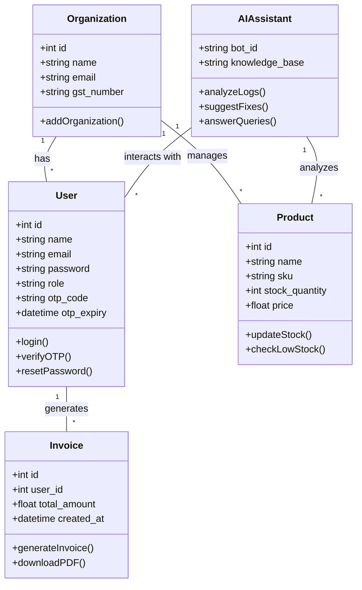
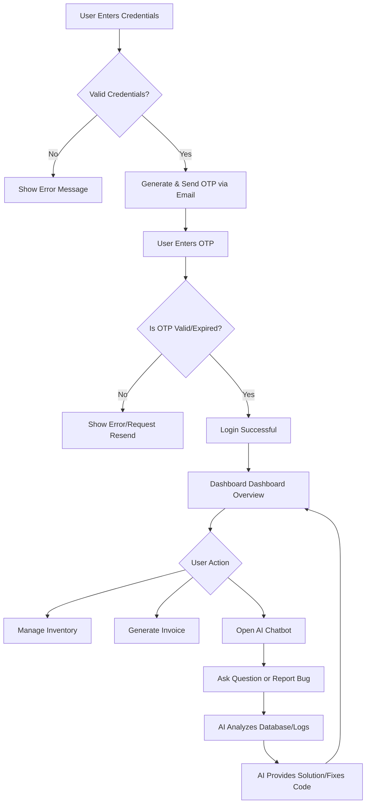

# Stocksathi - System Architecture & UML Diagrams

This document contains the structural and behavioral diagrams for the Stocksathi inventory management system, including the newly added AI Chatbot feature.

## 1. Use Case Diagram
The Use Case diagram shows the interactions between different types of users (Actors) and the system features (Use Cases).

```mermaid
usecaseDiagram
    actor "Super Admin" as SA
    actor "Admin/Manager" as AM
    actor "Employee/User" as EU
    
    package "Stocksathi System" {
        usecase "Login & OTP Verification" as UC1
        usecase "Manage Organizations" as UC2
        usecase "Manage Users & Roles" as UC3
        usecase "Manage Inventory/Stock" as UC4
        usecase "Generate Invoices" as UC5
        usecase "View Reports & Analytics" as UC6
        usecase "Interact with AI Chatbot" as UC7
        usecase "AI Automated Bug Fixes" as UC8
    }
    
    SA --> UC1
    SA --> UC2
    SA --> UC3
    SA --> UC4
    SA --> UC5
    SA --> UC6
    SA --> UC7
    SA --> UC8
    
    AM --> UC1
    AM --> UC4
    AM --> UC5
    AM --> UC6
    AM --> UC7
    
    EU --> UC1
    EU --> UC4
    EU --> UC5
    EU --> UC7
```

## 2. Class Diagram
The Class diagram provides an overview of the core database entities and system objects.



## 3. Activity Diagram (Login Flow with OTP & AI Support)
This diagram illustrates the flow from logging in to interacting with the dashboard and the AI assistant.


